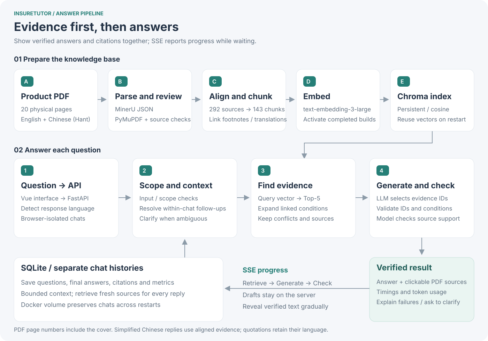
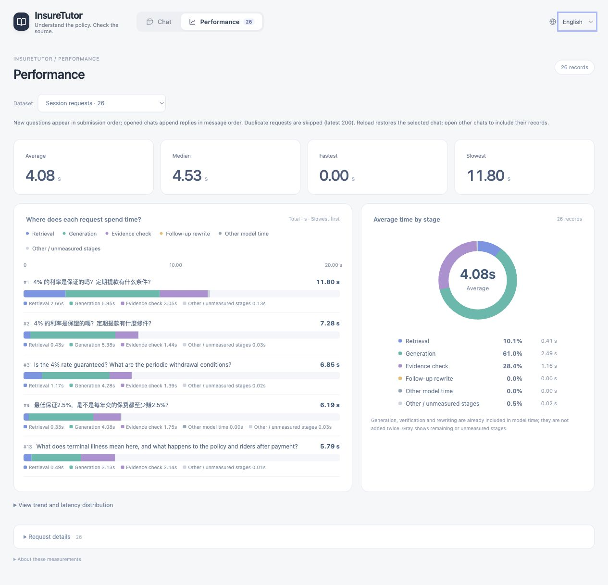

# InsureTutor | Delivery Guide

A conversational tutor for the **FLEXI-ULife Prime Saver** brochure. Users can ask in English, Simplified Chinese or Traditional Chinese, continue a conversation, and open the cited PDF page. The demo explains the brochure's terms and historical figures; it does not provide personal insurance recommendations.

**[Repository](https://github.com/newDarwin100/InsureTutor)** · **[Setup](README.md)** · **[Development decisions](docs/EXECUTION.md)** · **[中文](DELIVERY.zh-CN.md)**
**Demo video: link to be added.** The video is supplementary; the required submission is the repository and README.

## 1. Run the demo and review the deliverables

Install Docker, clone the repository, then run:

```bash
cp .env.example .env
# Set your OpenAI key and models available to your account in .env.
bash scripts/start.sh
```

Open `http://127.0.0.1:8000` once readiness is reported. The first launch sends brochure chunks to OpenAI to build the vector index and incurs API usage. Later launches reuse the index. Chats and vectors persist in separate Docker volumes.

| Requirement | Implementation |
| --- | --- |
| Conversation and follow-ups | Chat interface, separate context for each conversation, titles and saved history; conversations survive refreshes and restarts |
| RAG over the supplied brochure | 292 evidence records and 143 chunks; embed the question, retrieve matches, then expand linked clauses and footnotes |
| Verifiable citations | Filename, physical page number, normalized source text and a link to the PDF page; page numbers include the cover |
| Safety and scope control | Input rules, scope classification, citation validation and evidence checks; refuse requests outside the scope and correct false premises |
| English and Chinese, with three-language support | Switchable interface, Traditional Chinese by default; answers follow the question's language. English and Traditional Chinese sources are aligned; Simplified Chinese uses conversion and generation. Quotations retain their original language. |
| Docker, secrets and commit history | Dockerfile and Compose; ignored `.env` with a configuration template; incremental commits for data, retrieval, answers, UI and deployment |

## 2. Repository and system flow

```text
InsureTutor/
├── frontend/                    # Vue + TypeScript
│   ├── src/
│   │   ├── App.vue              # Chat interface and conversation list
│   │   ├── components/          # Performance charts and icons
│   │   └── api/                 # SSE, requests and timing metrics
│   └── tests/                   # Frontend tests
├── backend/
│   ├── app/
│   │   ├── main.py              # API, PDF serving and health checks
│   │   ├── rag/                 # Indexing, retrieval and evidence links
│   │   ├── guardrails/          # Scope and safety rules
│   │   └── services/            # Generation, checks, follow-ups and history
│   └── tests/                   # Backend tests
├── data/
│   ├── processed/              # Cleaned evidence and chunks
│   ├── reviewed/               # Alignment and correction records
│   ├── chroma/                 # Local vector database; ignored by Git
│   └── history/                # Local chat database; ignored by Git
├── evaluation/                 # Reference questions, evidence and run reports
├── scripts/                    # Startup, indexing and validation
├── docs/                       # Source PDF, execution notes and video script
├── .github/workflows/          # CI
├── Dockerfile
├── docker-compose.yml
├── .env.example                # Configuration template
├── DELIVERY.en.md              # English delivery guide
├── DELIVERY.zh-CN.md            # Chinese delivery guide
└── README.md                   # Setup and design notes
```



The backend uses Python / FastAPI; the frontend uses Vue 3 / TypeScript / Vite. Chroma stores vectors and SQLite stores chats. The model selects evidence IDs, and the server supplies the corresponding quotations and page numbers.

## 3. Product interface and useful demo cases


*The chat screenshot replays the saved D01 / D04 demo results in the current interface. Source quotations remain in their original language.*



*The dashboard replays all 26 records from the 9 October regression report, including failures and safety refusals. The timings are historical, not a new benchmark of the current version. The 0.00 s minimum is a rounded rule-based refusal, not a generated answer. No private chats are included.*

Three cases worth demonstrating:

1. **Guaranteed versus non-guaranteed returns:** “Is the 4% rate guaranteed?” Distinguish the non-guaranteed assumed rate from the conditional long-term account value guarantee. The 2.5% figure does not mean every premium earns 2.5% every year.
2. **Find the restriction as well as the headline:** “If I am made redundant, how long can premium payments be suspended? Are riders included?” An English query retrieved the 365-day special grace period in the Top-5 but missed the next-page footnote limiting it to the Basic Plan. Expanding the saved body–footnote link recovered the restriction, preventing a payment deferral from being described as a waiver or extended to all riders.
3. **Follow-ups with checkable evidence:** Ask “What are the periodic withdrawal conditions?”, then “What about annual withdrawals?” in the same chat. Resolve the follow-up and retrieve fresh evidence; open citations to check amounts, durations, fees and the cash-value condition.

Additional features include **12 guardrail reason categories**, covering prompt injection, privacy requests, personal recommendations, source conflicts, false premises, invalid citations and mismatched insurance conditions. The dashboard records retrieval, generation, verification, rewriting and token usage, with stacked bars, a donut chart, a trend and a histogram. Conversation memory is isolated; long-term user profiles remain a future extension.

## 4. Key decisions and trade-offs

| Choice | Alternatives and reasoning |
| --- | --- |
| Vue + Vite, plain CSS and SVG | Considered Streamlit and a larger frontend framework. Vue supports the chat interactions, conversation list and charts while keeping dependencies and page count small. |
| MinerU with targeted PDF checks | MinerU JSON preserves layout, text and tables. PyMuPDF and source checks help repair omissions, with corrections recorded. Align the original text before chunking rather than asking a model to rewrite the entire brochure. |
| Clause-based chunks with linked expansion | Preserve section and table-row boundaries instead of relying only on fixed windows. Long passages use a 1,200-character limit and 120-character overlap. Smaller chunks make sources easier to locate; links recover footnotes and conditions, at the cost of maintaining those relationships. |
| Local Chroma + SQLite | One brochure and a local demo do not need extra database services. Shared storage and conversation coordination would be required for multiple backend instances. |
| Large embeddings / configurable LLM | An actual retrieval comparison supports the large embedding configuration. The current LLM is `gpt-5.6-luna`; no controlled LLM comparison has been completed, so it is not claimed to be optimal. |
| Display the final answer after verification | SSE reports progress while waiting; verified text is then revealed gradually. This avoids withdrawing an answer midway through reading. Visible first text must wait for generation and verification, so **a response under two seconds is not guaranteed**. |

**The embedding decision is supported by measurements.** The comparison used the same 143 chunks, 12 trilingual development questions, Top-5 retrieval and expansion rules:

| Configuration | Mean direct Recall@5 | Reference evidence coverage after expansion |
| --- | ---: | ---: |
| `text-embedding-3-large` / 3072 dimensions | 87.50% | 100% |
| `text-embedding-3-small` / 1536 dimensions | 66.67% | 79.17% |

Large was retained to improve coverage of guarantees and eligibility restrictions. Both model and dimensions differ in this comparison; this small retrieval sample does not measure answer accuracy. [Comparison and per-question results](evaluation/results/embedding-comparison.md).

## 5. Validation and current limitations

- **Engineering checks:** 85 backend and 11 frontend offline tests passed, along with type checking and the frontend build. [CI](https://github.com/newDarwin100/InsureTutor/actions/workflows/checks.yml) checks tests, the production image and endpoints that require no paid model calls. A local build from empty volumes succeeded; recreating the container reused the index and restored test chats. Health checks, PDF Range requests and private-file isolation passed.
- **Answer checks:** [Six demo cases](evaluation/results/demo-answers.md) retain real results for three languages, unemployment, withdrawals and a follow-up. The broader [initial 26-case regression](evaluation/results/answer-regression.md) exposed missed conditions and false refusals. Four of [five targeted reruns](evaluation/results/answer-regression-fixes.md) passed; later changes to terminal-illness case R13 still await a real rerun. There is no claim that all cases passed.
- **Limits:** 32 image-only blocks were excluded from the text index. Genuine differences between language editions are retained and flagged rather than translated away. Rules and model checks can still misclassify requests. This is a local, single-instance demo without account login, cross-device sync, production load tests or independent review by an insurance expert.

## 6. Scaling beyond the demo

| Need or bottleneck | Next option and decision criteria |
| --- | --- |
| More users and multiple backend instances | Move chats to PostgreSQL; consider Redis for shared caching and conversation coordination. Add login, rate limits and backups. Resolve process-local locks and caches before adding instances. |
| More products and vectors | Add product/version filters and separate evaluation sets. [pgvector](https://github.com/pgvector/pgvector) suits managing vectors alongside PostgreSQL relational data; evaluate [Qdrant](https://qdrant.tech/documentation/scaling/distributed_deployment/) when the vector service needs independent scaling, sharding and replicas. |
| Generation and verification dominate latency | Reduce repeated context, control answer length and compare candidate models on the same questions for quality and latency. Expand query-vector caching and measure API quotas and queueing. A vector database change alone will not remove model waiting time. |

These are proposed extensions, not implemented or load-tested features. Use concurrency, p95 total latency, error rate, condition coverage and cost per request to decide when to migrate; no fixed capacity or speedup is promised.

---

**Submission: repository link + README + this guide.** An optional three-minute video can follow the [recording script](docs/VIDEO_SCRIPT.zh-CN.md), showing trilingual answers, footnote restrictions, follow-ups, PDF navigation, scope checks and performance charts. Add the video link before submission and confirm reviewer access against the invitation email.
