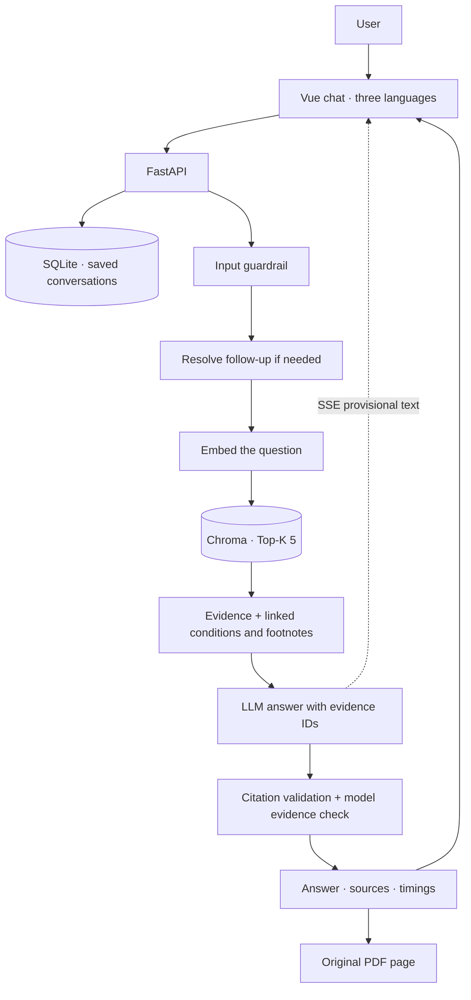

# InsureTutor

A conversational tutor for the **FLEXI-ULife Prime Saver** brochure. Ask in English, Simplified Chinese or Traditional Chinese, inspect the cited text and open its PDF page.

Vue 3 + TypeScript · FastAPI + Python · persistent Chroma. API keys stay on the backend.

## Run with Docker

Requires Docker with Compose and an OpenAI API key with access to the configured models.

```bash
git clone https://github.com/newDarwin100/InsureTutor.git
cd InsureTutor
cp .env.example .env
# Edit .env: set OPENAI_API_KEY and models available to your account.
bash scripts/start.sh
```

Open **http://127.0.0.1:8000** after readiness is reported.

On first start, the container validates the checked-in data and embeds **143 text chunks** into a named volume. This sends brochure text to OpenAI and incurs embedding usage. Subsequent starts reuse an unchanged index. Changes to sources, model or dimensions produce a new index version; completed batches can resume, and activation happens only after the build completes.

After image construction, the script waits up to 10 minutes for local RAG readiness. Dependency downloads during the image build may take longer. A failure prints recent logs and requires an explicit retry.

```bash
docker compose logs -f app     # Index and server progress
docker compose down           # Stop; retain the index
bash scripts/start.sh         # Restart or retry after fixing configuration
```

Do not use `docker compose down -v` unless you intend to delete both the saved chats and the index (and pay to rebuild the latter). Local development data and Docker volumes are separate.

**Validation status:** the production image built successfully on a clean Linux GitHub runner, with its compiled page, health routes and PDF ranges checked. Initialization and reuse are covered by offline tests. Docker is not installed on the development machine; paid fresh-volume indexing, a real container answer and restart reuse remain unverified.

GitHub Actions runs offline tests, builds the production image and checks its compiled page, health routes and PDF byte ranges. CI uses no API key: RAG readiness must return 503, and normal startup must stop without configuration. This checks the container packaging; it does not verify paid first-time indexing or insurance answers. See [CI runs](https://github.com/newDarwin100/InsureTutor/actions/workflows/checks.yml).

## Try the demo

- “Is the 4% interest rate guaranteed?”
- “被裁员后能停缴多久？附加保障也适用吗？”
- “定期提款有什么条件？” — then “那每年提款呢？”

Language selection changes the interface. Answers automatically match each question's Simplified Chinese, Traditional Chinese or English text. Script detection uses local OpenCC dictionaries; ambiguous shared Chinese characters keep the chat's preceding Chinese script (a new chat defaults to Simplified Chinese). Mixed Chinese/English text is treated as Chinese. Quotations retain their original language. Click a citation number to reveal its text and PDF link. Page numbers count the cover; direct PDF jumping depends on browser support.

The left sidebar lists saved conversations. Titles start with the first question; rename them, create a new chat, or reopen an older one. SQLite stores questions, returned answers, citations, timings and failed/interrupted requests at `data/history/chats.sqlite3`. Refreshing the page or restarting the backend keeps the transcript and bounded follow-up context. Deleting a chat requires a confirmation and removes its messages too.

A browser credential in localStorage identifies its conversation list; chat credentials are sent in headers, never URLs. Use the same browser and address to reopen the same list. This is local demo access, without account login or cross-device sync. Clearing browser storage loses access to that browser's list. The database is excluded from Git and Docker build context; Docker keeps it in the separate `chat-history` volume. Old process-only sessions from previous versions cannot be recovered.

The composer stays at the bottom of the viewport. Enter sends; Shift + Enter adds a line. `/api/chat/stream` uses POST + SSE: model-generated answer text appears as it arrives, with a **not yet verified** label. Citations appear only after the final evidence check; failed checks or interrupted streams clear the provisional text. The transcript follows new content unless you scroll upward; “Jump to latest” resumes following. There is no additional typewriter delay after the response finishes.

The Performance tab shows per-request latency, its cumulative average, a latency histogram and average/median/minimum/maximum values. Switch between returned requests on this page and separate saved test sets; timing stages can be filtered. Request details and token usage are collapsed by default. Chart measurements stay in browser memory (latest 200, reset on refresh); saved conversations still retain each reply's timings. Opening the tab does not call a model or copy private chats into evaluation reports.

First-text time measures submission to the first nonblank answer text, excluding loading messages, JSON fields and heartbeats. Generation, evidence checks and follow-up resolution are measured separately. **Under 2 seconds is a target, not a per-request guarantee**: query embeddings, ambiguous follow-up resolution and upstream API variation occur before answer text can arrive. Old non-streaming records have no first-text measurement.

## Architecture



Clear misuse requests stop before retrieval; ambiguous follow-ups ask for clarification. Unsupported drafts are removed from the UI after checking and are never saved as accepted answers. Streaming exposes provisional content before semantic verification, so users must wait for confirmation before relying on it. Optional repair allows at most one additional attempt.

History resolves what a follow-up refers to. Full transcripts are saved, but only up to 8 successful/clarification turns and 24,000 characters are retained as model context; the rewrite uses the latest 4. Idle context is evicted from the in-process cache after 30 minutes and restored from SQLite on demand. Every answer retrieves fresh PDF evidence; previous assistant text is not a factual source.

## Design decisions

| Decision | Choice and reason | Trade-off |
| --- | --- | --- |
| Frontend | Vue + Vite, one chat page and plain CSS cover the required interactions. | No larger application framework or component library. |
| Orchestration | Small Python modules with explicit provider calls make context and usage inspectable. | Validation and error handling are implemented locally. |
| Database | Embedded Chroma persists one small brochure without a separate service. | Larger corpora and concurrent workloads need a measured storage/service comparison. |
| Parsing | MinerU JSON preserves text, layout and tables; targeted PDF checks resolve gaps. | Some image-only content is unindexed. PyMuPDF/pypdf support inspection; they do not replace reviewed extraction. |
| Chunking | Sections, table rows and footnote links; 1,200-character cap, 120-character overlap for long passages. | More bookkeeping than fixed windows. Character limits are not token limits. |
| Languages | Align original English and Traditional Chinese; generate Simplified Chinese answers from those sources. | Translations are never labeled as original PDF quotations. |
| Citations | The model selects IDs; the server supplies text, filename and page. Display groups sources by page. | Valid IDs alone do not prove semantic support. |
| Guardrails | Input rules, model scope classification and output evidence checks; conflicts apply to disputed fields. | Rules and model checks can miss errors or reject valid answers. |
| Memory | SQLite saves full transcripts; model context stays bounded to 8 turns / 24,000 characters, one worker. | Local browser credentials, not user accounts. Cross-device sync, pagination for large histories and multi-worker coordination remain future work. |
| Models | Configurable LLM; saved reports use `gpt-5.6-luna` and `text-embedding-3-large`. | Check account availability. No controlled model comparison is complete. |
| Deployment | Multi-stage Docker build; FastAPI serves the compiled frontend. | First startup needs embedding access; local readiness cannot prove remote model availability. |

### A retrieval failure that shaped the design

An English unemployment question retrieved the **365-day special grace period** but missed the next page's **Basic Plan only** footnote. Following the reviewed body-to-footnote link recovered the missing restriction.

We keep smaller retrieval chunks and expand known relationships before increasing Top-K or adding a reranker. Direct recall and expanded coverage are scored separately. Expansion cannot help when the relevant body text was never retrieved.

[Execution notes](docs/EXECUTION.md) · [full retrieval report](evaluation/results/full-large.md).

## Configuration and cost

Copy `.env.example` to `.env`; never commit the real key.

| Variable | Purpose |
| --- | --- |
| `OPENAI_API_KEY` | Backend-only credential. |
| `LLM_MODEL` | Generation, evidence check and optional follow-up resolution. |
| `EMBEDDING_MODEL` | Document/query embeddings; default `text-embedding-3-large`. |
| `EMBEDDING_DIMENSIONS` | Optional override; changing it requires a new index. |
| `RAG_TOP_K` | Initial retrieval count; default 5. |
| `ANSWER_REPAIR_ENABLED` | Default `false`; `true` permits one extra generation/check attempt. |
| `CHAT_HISTORY_PATH` | Optional SQLite path; default `data/history/chats.sqlite3`. |

Ordinary questions use a query embedding, generation and evidence check. Contextual follow-ups may add a resolution call; enabled repair adds usage. Responses show actual timings and provider usage. Unknown report values remain blank.

Reviewed equivalent translations are compacted before generation; conflicting wording and linked conditions remain. Successful checks return a compact verdict. Unambiguous monthly/annual withdrawal follow-ups use local subject resolution, then retrieve evidence again. A bounded 10-minute in-memory query-vector cache (128 entries) avoids repeated embedding calls; it caches vectors, never answers, and is separated by index/model configuration and credential changes. Cache hits report zero newly billed embedding input tokens and their actual current retrieval time.

This brochure includes historical illustrations; answers explain its stated terms rather than claim its rates or fees are current.

## Local development

Requires **Python 3.12** and **Node.js 22.12+** (or 20.19+). From the repository root:

```bash
python3.12 -m venv .venv
.venv/bin/python -m pip install -r backend/requirements.txt
npm ci --prefix frontend
cp .env.example .env
# Edit .env before the next command.
.venv/bin/python scripts/build_index.py --full
bash scripts/dev.sh
```

Keep an existing `.env`. Indexing calls the embedding API only for missing chunks; the development launcher does not build indexes or install dependencies.

Frontend: **http://127.0.0.1:5173**. API docs: **http://127.0.0.1:8000/docs**. Ctrl+C stops both services. Stop Docker before development; both use port 8000.

## Checks and evaluation

Offline tests use deterministic or mocked providers, without paid calls:

```bash
.venv/bin/python -m unittest discover -s backend/tests -v
.venv/bin/python scripts/check_full_alignment.py
.venv/bin/python scripts/evaluate_retrieval.py
npm test --prefix frontend
npm run build --prefix frontend
```

With a server running, `.venv/bin/python scripts/check_local.py` checks the built page, assets, health, PDF byte ranges and private-path isolation without calling a model.

| Endpoint | Meaning |
| --- | --- |
| `/health/live` | The API process responds. |
| `/health/ready` | Key configuration, reviewed sources and current index are locally ready; otherwise 503. Docker uses this endpoint. |

Readiness does **not** check API balance, model access or answer quality.

### Saved measurements

| Test set | Direct mean Recall@5 | Coverage after linked evidence expansion |
| --- | ---: | ---: |
| 12-chunk pilot, 12 multilingual questions | 95.83% | 100% |
| 143-chunk full index, 12 multilingual questions | 87.50% | 100% |
| Full index, 8 reference retrieval questions | 93.75% | 100% |

These small development sets measure retrieval, not overall answer correctness. [Reports](evaluation/results/full-large.json) preserve rankings and usage; cached timings remain the original measurements.

The dashboard includes **38 historical rows**, including failures and two unexecuted safety cases. One answer passed the model check but human review found missing withdrawal conditions. This prompted context expansion; that run is not an independently verified correct answer. See [answer checks](evaluation/results/single-turn.md).

A later [demo-example regression](evaluation/results/demo-answers.md) covers six fixed examples: the compound rate/withdrawal question in all three languages, unemployment, withdrawal conditions and an annual-withdrawal follow-up. The first batch returned five answers and one mistaken rejection; targeted fixes and reruns are preserved. Each case now has an answered result with key facts manually checked. This is a development regression, not an overall quality score.

The [streaming check](evaluation/results/streaming.md) records two live runs of three fixed questions, including a follow-up. The latest first-text times were 1.99 / 1.75 / 1.57 seconds; the earlier run includes two misses of the 2-second target. These are small development samples, without a p95 latency guarantee or controlled model comparison. Browser stream handling was checked separately with saved-answer replay, not counted as new API latency measurements.

Paid evaluations are separate, explicit commands:

```bash
.venv/bin/python scripts/run_retrieval_pilot.py
.venv/bin/python scripts/run_full_retrieval.py
.venv/bin/python scripts/check_answers.py --run
.venv/bin/python scripts/check_demo_examples.py --run
```

They send fixed questions and/or brochure text to OpenAI and may incur usage. Retrieval scripts reuse index/query caches; check cache fields before treating a run as a fresh latency measurement.

## Source data and remaining work

Checked-in data contains **292 evidence records and 143 chunks**, source hashes, physical pages, table structure and reviewed bilingual relationships. Raw MinerU exports and local indexes are excluded from Git and the image. Fresh Docker startup uses reviewed processed data.

Two genuine bilingual discrepancies remain: an age boundary and minimum amounts for a sum-insured change. They are not silently reconciled. See the [source review](data/reviewed/full_alignment.md).

Remaining submission gates: an actual Docker build/fresh-volume run and complete answer-level checks across languages, multi-turn cases and safety false positives. Some chart content is not indexed. Model verification can misjudge support. No load test or controlled model comparison has been reported.

## Repository guide

| Path | Contents |
| --- | --- |
| `frontend/src/` | Chat, translations, citations and evaluation panel. |
| `backend/app/` | API, retrieval, guardrails, model calls and sessions. |
| `backend/tests/` | Offline regression tests. |
| `data/processed/`, `data/reviewed/` | Knowledge and source review. |
| `evaluation/` | Reference questions, scoring and saved reports. |
| `scripts/` | Preparation, indexing, checks and launchers. |
| `docs/` | Supplied PDF, task and Chinese [execution log](docs/EXECUTION.md). |
