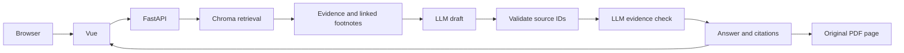

# InsureTutor

基于保险 PDF 的多语言 AI 导师，计划支持多轮问答、可验证引用、安全控制和评测看板。

技术方向：Vue 3 + Vite + TypeScript、Python + FastAPI、本地 ChromaDB。

## 目录

```text
frontend/src/
  components/       页面组件
  api/              后端请求与类型
backend/
  app/
    api/            FastAPI 接口
    rag/            文档处理与检索
    guardrails/     安全检查
    services/       模型、会话、编排和指标
  tests/            逻辑测试
data/
  raw/              PDF 直接提取结果
  processed/        清洗、对齐、分块
  chroma/           生成索引
evaluation/results/ 真实评测报告
scripts/            提取、索引、评测、启动脚本
docs/               原始 PDF、任务和执行清单
```

## 当前状态

页面已接通 RAG 问答和会话追问，可以选择简体、繁体或英文回答，回答在一个气泡内展示，引用按实际PDF页码归组、默认折叠；点击编号可展开整理后的原文，并打开对应PDF页。同一页面可接着追问；历史用于明确问题对象，每轮仍重新检索PDF。143块全文 Chroma 索引已建立，能重启复用。

模型选择证据 ID，引用原文、文件名和页码由后端读取；同一模型再单独核对结论的支持关系，失败的草稿不展示。模型核对仍可能误判，不能代替人工验收。英文利率问题真实测试通过；中文提款题两次被拦截，其中一次是模型抄错引用，现已改为后端直接读取原文。修改后只做免费回归，中文真实验收仍待完成。自动检查55项通过。

Docker 配置与启动脚本已写好，但当前开发机器未检测到 Docker，容器构建/运行尚未验证。已接入输入规则和模型分类、引用及依据核对；安全规则仍需真实模型正反例校准。会话隔离和追问流程已通过免费检查，真实多轮质量仍待验收；全页面三语言和评测看板仍待完成。

开发顺序见 [执行清单](docs/EXECUTION.md)，数据约定见 [数据目录说明](data/README.md)。

## 本地开发

需要 Python 3.12 和 Node.js 22.12+（或 20.19+），首次准备：

```bash
python3.12 -m venv .venv
.venv/bin/python -m pip install -r backend/requirements.txt
cd frontend
npm ci
cd ..
```

如果已经有 .venv，不必重新创建。配置 .env 后：

```bash
bash scripts/dev.sh
```

访问 http://127.0.0.1:5173，接口文档在 http://127.0.0.1:8000/docs。Ctrl+C 停止两端。脚本只启动已安装的依赖，不自动安装。前端 dev server 代理后端 API。

## 小样本向量检索

配置 `.env` 后运行：

```bash
.venv/bin/python scripts/run_retrieval_pilot.py
```

先检查已核对的数据，再把9个目标块和3个干扰块存入 `data/chroma/pilot/`，运行12道三语言检索题。首次调用 OpenAI embedding API；未改变的小样本索引和问题结果会复用，避免重复付费。保留原始结果可使用 `--output /tmp/pilot-rerun.json` 指定新报告。

本次用 `text-embedding-3-large`、3072维、cosine、Top-K=5：11/12题直接找齐必要证据，按必要条款组计算的平均 Recall@5 为95.83%；沿明确脚注关联补齐后覆盖率100%。漏项是英文失业问题里的“只适用于基本计划”。两项指标分别保存，不能把补齐效果算成直接召回提升。

实际报告：[小样本结果](evaluation/results/pilot-large.json)。这是12块的小库测试，含已知目标；该小库报告不代表全量表现或回答/引用质量；全量检索结果见下节，也未比较 small 模型。

全文提取数据已核对并建立索引，冲突与图像提取限制保留。单独构建/复用索引与查询：

```bash
.venv/bin/python scripts/build_index.py --full
.venv/bin/python scripts/search_knowledge.py "Is the 4% interest rate guaranteed?"
```

模型、维度、PDF、分块及相关证据配置相同就复用索引；变化后按新版本构建，每批写入可断点继续，全部写好才切换。文件保存在 `data/chroma/`，不提交 Git。当前支持 macOS/Linux；页面聊天和 Docker 自动初始化仍待接入。

## Docker（配置已准备，待实机验证）

安装并启动 Docker（含 Compose），准备 .env 后执行：

```bash
bash scripts/start.sh
```

等价的构建/启动命令是 `docker compose up --build -d`。访问 http://127.0.0.1:8000；使用者无需本地 Node/Python。前端在镜像构建阶段编译，运行时由 FastAPI 提供。

- 日志：`docker compose logs -f app`
- 停止：`docker compose down`
- 索引 volume 保留；本地索引不会自动复制到容器，容器首次启动目前不会自动调用模型或建库。
- 首次构建需要网络下载依赖。

## 验证

```bash
.venv/bin/python -m unittest discover -s backend/tests -v
.venv/bin/python scripts/evaluate_retrieval.py
```

前端类型检查与构建：在 frontend 运行 `npm run build`。
构建后启动后端，可运行 `.venv/bin/python scripts/check_local.py` 检查真实 HTTP 页面、资源、PDF 和路径隔离；不调用模型。

- `/health/live`：200，网页进程正常，Docker 使用此项。
- `/health/ready`：配置、已核对来源及全文索引就绪时200，否则503；不探测远端模型。
- `/api/demo`：明确的免费连接测试；`/api/chat` 调用单轮问答服务。
- PDF 只通过固定 document_id 开放，页码链接形如 `/api/documents/flexi-ulife-prime-saver#page=12`。浏览器决定是否支持直接跳页；页面可展开引用原文核验。

## 当前链路



当前链路每轮重新检索，追问会先明确指代。明确安全请求由本地规则在检索前拒绝，其他范围判断合并到回答模型。会话记忆为单进程短期存储，三语言页面翻译尚未完成。

## 配置

真实 key 保存在根目录 .env，不提交 Git，仅后端读取。配置格式参照 .env.example。

## 数据核对

全文提取文本的中英文对应和用途记录见 [核对报告](data/reviewed/full_alignment.md)，当前292条证据、143块。第19页英文免责声明等4块从原MinerU discarded_blocks恢复，原JSON不需重新识别。两处原文冲突和未提取的图表内容仍明确记录。

```bash
.venv/bin/python scripts/check_full_alignment.py
```

全量检索脚本为 `.venv/bin/python scripts/run_full_retrieval.py`：先检查来源，再建立完整文本索引，分别报告三语言问题和首批参考题的检索结果。安全题暂不执行，追问只拼接之前的用户问题；不会把这些测试说成安全和会话功能已完成。

## 全量检索基线

143块文本、large模型、Top-K=5。12道三语言题的平均直接Recall@5为87.50%，8道参考检索题为93.75%；脚注关联补齐后的必要证据覆盖率均为100%。两种计分粒度分别保存，不合并，也不代表回答质量。

漏项集中在利率非保证说明和失业保障仅基本计划的脚注。与12块小库相比，全量更容易漏条件，回答上下文已按这些关联补齐证据。

[结果说明](evaluation/results/full-large.md) · [完整排名和用量](evaluation/results/full-large.json)。全量脚本会缓存固定问题的排名，重复运行不会默认重新测量API延时。两个安全案例和真正多轮尚未验证；页面已接通单轮问答。

## 单轮回答检查

先运行 `.venv/bin/python scripts/build_index.py --full` 建立或复用索引，再启动开发服务。健康检查只核对配置、已核对来源和索引版本，不调用模型、不验证远端余额。索引缺失或来源变更时 `/health/ready` 返回503。

免费检查：

```bash
.venv/bin/python -m unittest discover -s backend/tests -v
.venv/bin/python scripts/check_local.py
```

固定问题实测会发送问题及检索原文到 OpenAI，并产生 API 用量；不会自动运行：

```bash
.venv/bin/python scripts/check_answers.py --run
```

报告写入 `evaluation/results/single-turn.json`，包含固定测试的模型诊断。应用只在当前后端进程内保存受限会话，不把用户问答写入文件。每条回答显示检索、模型生成与核对、总耗时，以及分开的 embedding / LLM 用量；当前没有自动重试或流式展示。真实报告及限制见 [单轮实测说明](evaluation/results/single-turn.md)。

## 安全检查

输入先用本地规则检查明显的注入、索要秘密、粘贴API key、个性化购买建议、个案医疗/法律建议、其他产品和明显无关请求；命中时不检索、不调用模型。普通疾病保障、费用和保证性质的问题继续交给证据限定问答。复杂范围判断与回答共用一次模型调用，返回明确原因分类；规则不是完整的攻击识别器。

输出检查引用是否属于本次证据、结论涉及的具体原文冲突是否被静默处理，以及模型核对的结论支持关系。失败不展示草稿。`ANSWER_REPAIR_ENABLED=false` 为默认值；开启后最多修正一次，再次检查仍失败则拒绝展示，全部用量计入原请求。模拟测试只验证控制流程，不代表真实模型安全通过率。

## 会话记忆

页面首次提问时创建会话，凭证仅留在当前页面内存，通过 `X-Conversation-Token` 请求头发送，不放在URL或localStorage中。不同页面各自创建会话；清空会同时删除后端历史。30分钟未使用过期，最多8轮/24,000字符，服务重启或开发reload后失效；失效时清空重开即可。

追问使用最近4轮明确对象，再按独立问题重新检索。明确完整问题跳过改写调用，指代不明则澄清。历史中的助手说法不作为保险证据，失败或拒绝的问答不进入记忆。改写的真实耗时和用量计入该请求。

当前只支持一个后端worker，最多100个活动会话；同一会话的重叠请求返回409。未来部署多实例需要共享存储和身份控制。多轮流程已用模拟模型检查，未报告真实追问成功率。
