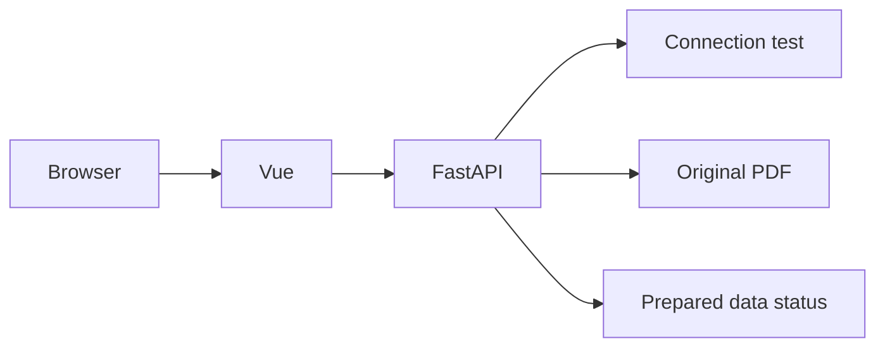

# InsureTutor

基于保险 PDF 的多语言 AI 导师，计划支持多轮问答、可验证引用、安全控制和评测看板。

技术方向：Vue 3 + Vite + TypeScript、Python + FastAPI、本地 ChromaDB。

## 目录

```text
frontend/src/
  components/       页面组件
  api/              后端请求与类型
backend/
  app/
    api/            FastAPI 接口
    rag/            文档处理与检索
    guardrails/     安全检查
    services/       模型、会话、编排和指标
  tests/            逻辑测试
data/
  raw/              PDF 直接提取结果
  processed/        清洗、对齐、分块
  chroma/           生成索引
evaluation/results/ 真实评测报告
scripts/            提取、索引、评测、启动脚本
docs/               原始 PDF、任务和执行清单
```

## 当前状态

Vue + FastAPI 最小应用已可运行，页面支持连接测试、资料状态和指定页码的 PDF 链接。已完成规则清洗分块、10个参考测试案例及检索计分工具，已加入 Chroma 持久化索引和命令行检索，自动检查共26项。页面仍是连接测试，尚未接入保险回答。

Docker 配置与启动脚本已写好，但当前开发机器未检测到 Docker，容器构建/运行尚未验证。12块小样本已通过真实 API 检索测试，全量索引未建立；生成回答、多轮、完整三语言 UI、Guardrails 和看板仍待接入。

开发顺序见 [执行清单](docs/EXECUTION.md)，数据约定见 [数据目录说明](data/README.md)。

## 本地开发

需要 Python 3.12 和 Node.js 22.12+（或 20.19+），首次准备：

```bash
python3.12 -m venv .venv
.venv/bin/python -m pip install -r backend/requirements.txt
cd frontend
npm ci
cd ..
```

如果已经有 .venv，不必重新创建。配置 .env 后：

```bash
bash scripts/dev.sh
```

访问 http://127.0.0.1:5173，接口文档在 http://127.0.0.1:8000/docs。Ctrl+C 停止两端。脚本只启动已安装的依赖，不自动安装。前端 dev server 代理后端 API。

## 小样本向量检索

配置 `.env` 后运行：

```bash
.venv/bin/python scripts/run_retrieval_pilot.py
```

先检查已核对的数据，再把9个目标块和3个干扰块存入 `data/chroma/pilot/`，运行12道三语言检索题。首次调用 OpenAI embedding API；未改变的小样本索引和问题结果会复用，避免重复付费。保留原始结果可使用 `--output /tmp/pilot-rerun.json` 指定新报告。

本次用 `text-embedding-3-large`、3072维、cosine、Top-K=5：11/12题直接找齐必要证据，按必要条款组计算的平均 Recall@5 为95.83%；沿明确脚注关联补齐后覆盖率100%。漏项是英文失业问题里的“只适用于基本计划”。两项指标分别保存，不能把补齐效果算成直接召回提升。

实际报告：[小样本结果](evaluation/results/pilot-large.json)。这是12块的小库测试，含已知目标；尚未验证139块全量、回答正确性或引用支持关系，也未比较 small 模型。

通用全量构建脚本已经准备，但本次不执行。等全文数据检查和小样本结果讨论后，再明确运行：

```bash
.venv/bin/python scripts/build_index.py --full
.venv/bin/python scripts/search_knowledge.py "Is the 4% interest rate guaranteed?"
```

模型、维度、PDF、分块及相关证据配置相同就复用索引；变化后按新版本构建，每批写入可断点继续，全部写好才切换。文件保存在 `data/chroma/`，不提交 Git。当前支持 macOS/Linux；页面聊天和 Docker 自动初始化仍待接入。

## Docker（配置已准备，待实机验证）

安装并启动 Docker（含 Compose），准备 .env 后执行：

```bash
bash scripts/start.sh
```

等价的构建/启动命令是 `docker compose up --build -d`。访问 http://127.0.0.1:8000；使用者无需本地 Node/Python。前端在镜像构建阶段编译，运行时由 FastAPI 提供。

- 日志：`docker compose logs -f app`
- 停止：`docker compose down`
- 索引 volume 保留；只构建了本地小样本，容器首次启动目前不会自动调用模型。
- 首次构建需要网络下载依赖。

## 验证

```bash
.venv/bin/python -m unittest discover -s backend/tests -v
.venv/bin/python scripts/evaluate_retrieval.py
```

前端类型检查与构建：在 frontend 运行 `npm run build`。
构建后启动后端，可运行 `.venv/bin/python scripts/check_local.py` 检查真实 HTTP 页面、资源、PDF 和路径隔离；不调用模型。

- `/health/live`：200，网页进程正常，Docker 使用此项。
- `/health/ready`：当前返回503，RAG 尚未接入，不能误报已就绪。
- `/api/demo`：明确的连接测试；`/api/chat` 当前返回503。
- PDF 只通过固定 document_id 开放，页码链接形如 `/api/documents/flexi-ulife-prime-saver#page=12`。浏览器决定是否支持直接跳页，引用原文展开仍需后续实现。

## 当前链路



三语言问答与完整 RAG 主图见执行清单，尚未实现的能力不会在当前页面冒充完成。

## 配置

真实 key 保存在根目录 .env，不提交 Git，仅后端读取。配置格式参照 .env.example。
