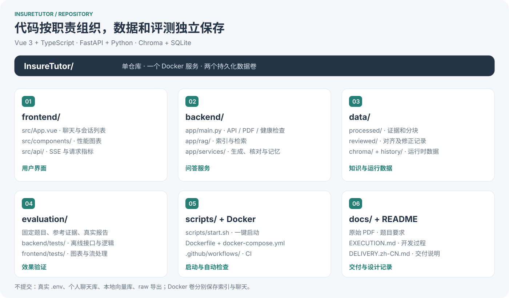
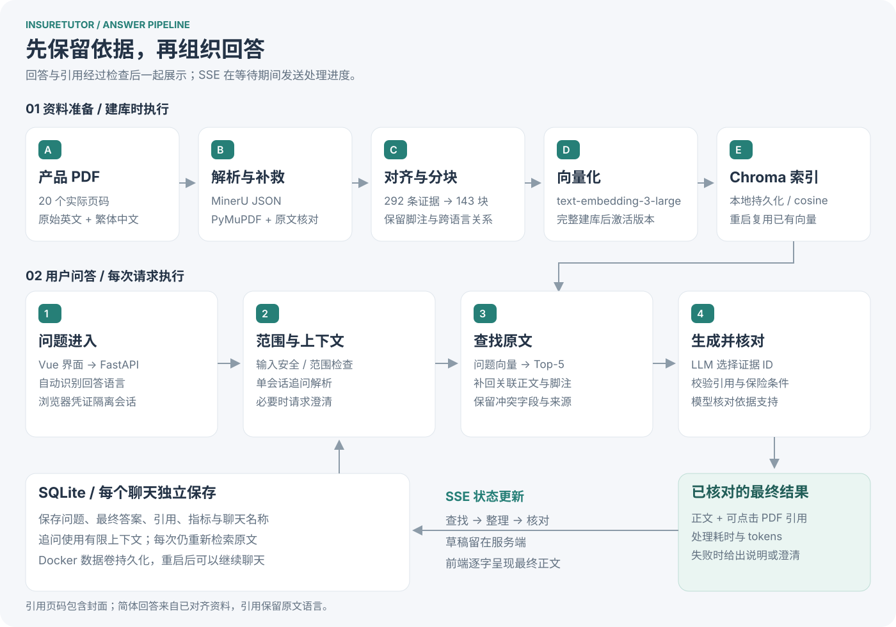
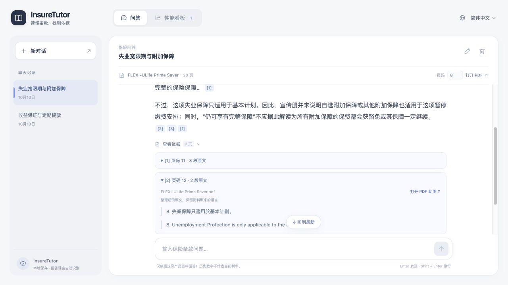
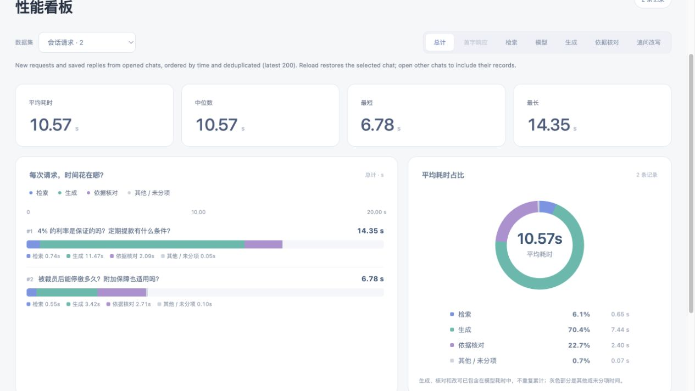

# InsureTutor｜中文交付说明

基于 **FLEXI-ULife Prime Saver** 产品资料的保险问答 Demo。用户可以用简体中文、繁体中文或英文提问、继续追问，并点击引用核对 PDF 原文。系统解释资料中的条款和历史数字，不提供个人投保建议。

**[代码仓库](https://github.com/newDarwin100/InsureTutor)** · **[启动与配置](../README.md)** · **[开发与取舍记录](EXECUTION.md)**  
**演示视频：待补链接**（补充材料；题目正式交付要求为仓库和 README）。

## 1. 怎么运行，完成了什么

安装 Docker，克隆仓库后执行：

```bash
cp .env.example .env
# 在 .env 填入 OpenAI key，确认账号可用的模型配置
bash scripts/start.sh
```

就绪后打开 `http://127.0.0.1:8000`。首次启动会向 OpenAI 发送资料分块建立向量索引，产生 API 用量；之后复用索引。聊天和索引分别保存到 Docker 数据卷。

| 题目要求 | 交付实现 |
| --- | --- |
| 对话与连贯追问 | 聊天窗口、独立会话上下文、命名与历史记录；刷新或重启后可继续 |
| 基于指定资料的 RAG | 292 条证据、143 个分块；问题向量检索，再补充关联条款与脚注 |
| 可核对的引用 | 文件名、实际页码、整理后的原文、直达 PDF 页面的链接；页码包含封面 |
| 安全与范围控制 | 输入规则、回答范围分类、引用校验和依据核对；拒绝越界请求，纠正错误前提 |
| 英文与中文，三语加分 | 问题与回答语言对应；英文、繁体原文对齐，简体通过转换与生成支持，引用保留原语言 |
| Docker、密钥与提交记录 | Dockerfile + Compose；`.env` 不入库，提供模板；按数据、检索、问答、界面、部署逐步提交 |

## 2. 仓库结构与整体流程





后端使用 Python / FastAPI，前端使用 Vue 3 / TypeScript / Vite；Chroma 保存向量，SQLite 保存聊天。模型输出证据 ID，服务端填入对应原文和页码，避免由模型自行编写出处。

## 3. 产品界面与值得展示的场景





*截图使用当前界面回放已保存的 D01 / D04 固定测试结果；图中耗时来自历史运行，不代表当前版本的新测速，也不包含个人聊天。*

建议演示时按这三个场景走：

1. **收益保证的边界**：“4% 的利率是保证的吗？”区分非保证假设利率与有条件的长期账户价值保证；不能把 2.5% 理解为每笔保费每年都赚 2.5%。
2. **正文找到了，限制也要找全**：“被裁员后能停缴多久？附加保障也适用吗？”英文问题曾在 Top-5 找到 365 日特惠宽限期，却漏掉下一页“只适用于基本计划”的脚注。保存正文与脚注关系后补回限制，避免把缓缴说成免缴或推及所有附加保障。
3. **追问与证据可验证**：先问“定期提款有什么条件？”，再在同一聊天问“那每年提款呢？”。解析追问后重新检索；打开引用，核对金额、年期、费用与现金价值条件。

额外完成：**12 类 guardrail 原因分类**（含提示注入、隐私请求、个人建议、资料冲突、错误前提、引用无效及保险条件不匹配）；按请求展示检索、生成、核对、改写和 tokens，并用堆叠柱图、环形图、趋势与直方图观察耗时。会话记忆互相隔离，长期用户画像留作扩展。

## 4. 关键取舍：为什么这样做

| 选择 | 考虑过什么，最后为什么这样选 |
| --- | --- |
| Vue + Vite / 原生 CSS 与 SVG | 比较过 Streamlit 与更完整的前端框架。当前需要聊天交互、会话列表和图表，保留 Vue，同时控制依赖与页面数量。 |
| MinerU + 定点 PDF 核对 | MinerU JSON 提供版面、文字与表格；PyMuPDF 等工具辅助检查缺漏，留下修正记录。对齐原文后分块，不用模型逐段重写整本资料。 |
| 条款分块 + 关联展开 | 相比只用固定窗口，按章节、表格行保留语义边界；长段上限 1,200 字符、重叠 120 字符。小块便于定位，正文与脚注关联补足条件；代价是维护关系更费工夫。 |
| 本地 Chroma + SQLite | 当前只有一份资料、本地 Demo，免去额外数据库服务。承认单实例边界，扩大部署时再迁移共享存储与会话协调。 |
| large embedding / 可配置 LLM | embedding 有实际同题比较，按条件覆盖选择 large；LLM 当前配置为 `gpt-5.6-luna`，尚未完成受控模型对比，不宣称它是最优。 |
| 核对后展示最终正文 | SSE 传递等待进度，核对完成后逐字呈现正文，避免读到一半被撤回。代价是可见首字要等完整生成和核对，**不保证低于 2 秒**。 |

**Embedding 的选择有测量依据：**固定同一批 143 块、12 道三语言开发题、Top-5 与关联规则，比较两种默认配置：

| 配置 | 直接 Recall@5 均值 | 关联展开后参考证据覆盖 |
| --- | ---: | ---: |
| `text-embedding-3-large` / 3072 维 | 87.50% | 100% |
| `text-embedding-3-small` / 1536 维 | 66.67% | 79.17% |

因此保留 large，优先找齐保证边界与适用限制。这里模型和维度同时不同；小样本检索覆盖率不能当作答案正确率。[原始比较与逐题结果](../evaluation/results/embedding-comparison.md)。

## 5. 验证结果与当前边界

- **工程验证：**85 项后端、11 项前端离线测试通过，类型检查与构建通过；[CI](https://github.com/newDarwin100/InsureTutor/actions/workflows/checks.yml) 检查测试、生产镜像及免费接口。本机空卷建库成功，重建容器后索引复用、测试聊天恢复；健康检查、PDF Range 与私有文件隔离通过。
- **问答验证：**[六道示例](../evaluation/results/demo-answers.md)保留三语、失业、提款和追问的真实结果。更广的 [26 题首轮回归](../evaluation/results/answer-regression.md)暴露了条件遗漏与误拦；随后 [五题定点复测](../evaluation/results/answer-regression-fixes.md)有四题通过，末期疾病定义题 R13 后续修正仍待真实复测。没有全题通过的结论。
- **边界：**图片中未提取成文字的 32 个块未入库；原文确有跨语言差异，保留并提示，不能直接“翻译修平”。安全规则与模型核对仍可能误判。当前为本地单实例 Demo，无账号登录、跨设备同步、生产压测或独立保险专家验收。

## 6. 用户与资料增加后，怎么扩展

| 出现的需求 / 瓶颈 | 下一步选型与判断依据 |
| --- | --- |
| 多用户、多个后端实例 | 聊天迁移 PostgreSQL；Redis 候选用于共享缓存和会话协调，补登录、限流、备份。先解决当前进程内锁与缓存的共享问题，再扩实例。 |
| 多产品、更多向量 | 增加产品 / 版本过滤与独立评测题。[pgvector](https://github.com/pgvector/pgvector)适合与 PostgreSQL 关系数据统一管理；需要向量服务独立扩容、分片与副本时评估 [Qdrant](https://qdrant.tech/documentation/scaling/distributed_deployment/)。 |
| 生成 / 核对持续占主要耗时 | 优先压缩重复上下文、控制输出长度，对候选模型做同题质量与延时比较；扩大问题向量缓存，评估 API 配额与排队。更换向量库无法直接消除模型等待。 |

以上是扩展方案，尚未实现或压测。以并发数、p95 总耗时、错误率、条件覆盖和单次成本决定迁移时机，暂不承诺某个用户规模或固定提速倍数。

---

**提交材料：仓库链接 + README + 本说明。** 可补一段约 3 分钟视频，依次演示三语回答、脚注限制、同会话追问、PDF 跳转、越界请求和性能图表；提交前补视频链接，并按邀请邮件确认评审账号的仓库访问权限。
