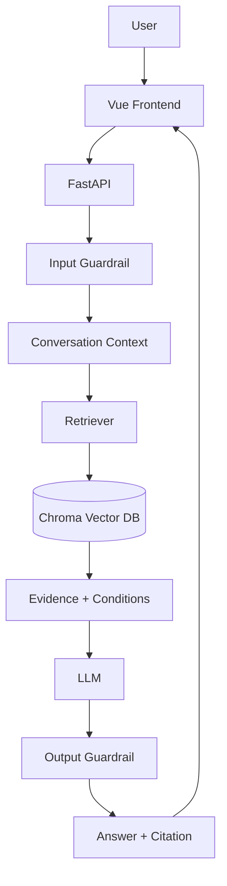

# InsureTutor：按顺序开发的执行清单

更新：2026-10-09。依据此前“NUS AIDF — InsureTutor 项目方案总结”、后续技术调整和用户的 12 个加分点。

按下列顺序开发。每步写清楚任务、候选方案、选择理由和验收；有实质取舍的模块才比较，简单功能直接做。完成后填实测结果，不为每个功能另建 Spec / Plan / Build 文档。

## 当前方向

- Vue 3 + Vite + TypeScript + 普通 CSS，一个聊天页面、少量组件。
- Python + FastAPI，原生 Python 组织 RAG；本地持久化 ChromaDB。
- SQLite保存聊天记录，模型只用本会话近期上下文；回答语言自动跟随简体/繁体/英文提问。
- PDF 解析比较现有 pypdf、PyMuPDF；MinerU 按实际解析问题引入。
- 本地开发主链路已完成，当前在收尾验收。下方早期条目已按实现同步；历史进度段保留当时状态，以最新验收记录为准。
- 必须交付聊天、RAG、Guardrails、中英文、Dockerfile、Compose、.env.example、README、真实增量 Git 提交。本项目还做简体/繁体/英文、可验证引用、领域案例、评测与耗时看板。
- 知识库只放保险材料，JD 和任务说明用于开发。截止时间以邀请邮件为准，任务本身只写收到后三天。

## 顺序总览

**第 0 步：先搭目录骨架（已完成）。** 建立前后端、数据、评测目录和职责说明。原始 PDF 保留 docs/，提取后的 raw 数据进 data/raw/，清洗/对齐/分块进 data/processed/，索引进 data/chroma/。Vue + FastAPI 已本地跑通；Docker 已完成空卷建库、接口和重建持久化检查，容器内保险答案留给手工验收。

先把 PDF 提取、清洗并核对到足以建立参考答案，再设计问题。清洗不追求一次彻底结束：后续测试发现缺失或错序时继续修正；分块在此之后单独进行。

| 步骤 | 任务 | 做完得到什么 |
| --- | --- | --- |
| 1 | 解析比较、清洗、中英文对齐 | 带原始页码的可信条款数据 |
| 2 | 根据核对后的条款写首批测试题 | 10 个带参考证据的保险案例 |
| 3 | Vue + FastAPI + Docker 最小链路 | 页面可调用后端，容器可启动 |
| 4 | 条款分块、关联脚注 | 可追溯且条件完整的检索单元 |
| 5 | embedding + Chroma + 检索基线 | 真实证据命中结果 |
| 6 | 单轮生成、Citation、指标采集 | 一条完整可核验回答 |
| 7 | 输入/输出 Guardrails | 分类明确、行为可测的安全控制 |
| 8 | 独立会话记忆和追问 | 连贯且互不串话的对话 |
| 9 | 三语言完整页面 | 可演示的产品界面 |
| 10 | 完整测试、模型比较、看板 | 真实质量报告和性能数据 |
| 11 | 针对失败优化、讨论扩展 | 有实测支持的取舍结论 |
| 12 | 全新环境验收、README | 可复现、可解释的交付仓库 |

测试随模块加入，第 10 步做完整回归；Docker 第 3 步启动，第 12 步完整验收。各步按真实工作提交，不凑提交数量。

## 什么时候 commit

按下面这些点提交。每次留下一段能跑、能检查的进展，之后出了问题也方便回头找原因。节点不用卡得太死：两件事确实要一起做就一起提交，做到一半发现值得单独修的问题，也可以先提交修复。

完成一个节点后 commit，再 push 到 origin/main。代码和对应的测试放在同一次提交里。小的样式调整可以跟着页面功能一起交；单纯改文档就检查文档，不用再花钱跑模型。提交前看一遍 diff，只带上这次改动，别把 key、本地索引和运行日志放进去。

| 做到这里就提交 | 提交前检查什么 | commit 示例 |
| --- | --- | --- |
| 向量索引建好，能够保存和复用 | 用少量真实文本查一次；重启后能复用，数据或配置变了能识别；构建失败不损坏旧索引 | `feat: add persistent vector indexing` |
| 10 道题的检索结果跑出来 | 保存题集、模型和配置；分别看直接检索命中和补齐脚注后的覆盖情况，找出漏了什么 | `test: add the first retrieval baseline` |
| 第一条完整回答和引用跑通 | 结论能找到原文支持，引用能展开、点击跳到 PDF 对应页；没找到依据时能说明 | `feat: add answers with PDF citations` |
| 输入拦截做好 | 测无关问题、注入、个性化购买建议，也测正常保险问题，避免拦错 | `feat: add input guardrails` |
| 回答检查做好 | 重点测保证与非保证、缺失条件、错误引用、原文冲突；修正一次还不通过就明确返回失败 | `feat: check insurance answers before display` |
| 多轮对话做好 | 追问能接上，两个会话不串话；清空、过期和重启的行为说得清楚 | `feat: add isolated conversation history` |
| 三语言页面能完整使用 | 同一个事实用三种语言问，答案一致；引用保留原文；请求失败后能继续使用，前端构建通过 | `feat: complete multilingual chat` |
| 耗时和用量看板能用了 | 计时没有重复，token 用量来自实际返回；打开看板只读取结果，不重新调用模型 | `feat: add evaluation timings and usage dashboard` |
| 完整评测和模型比较做完 | 跑 20–30 题，人工核对关键答案；比较模型时固定其他条件，记录失败案例和最终选型理由 | `test: evaluate answer quality and model choices` |
| 评测暴露的问题修好了 | 用同一道失败题复测；如果是性能优化，留下前后耗时和质量对比 | 按实际问题写，例如 `fix: include withdrawal conditions in retrieved context` |
| 容器首次建库与启动等待接好 | 免费检查来源失效、缺 key、建库/复用和失败退出；未跑 Docker 时说明局限 | `build: prepare the index on Docker startup` |
| Docker 在干净环境跑通 | 从没有索引开始启动，再测重启复用、错误配置和就绪状态；配置文件写好还不算完成 | `build: verify Docker startup from a clean state` |
| README 和交付说明写完 | 按说明重新走一遍；流程图与代码一致，写清测试结果、选型原因和还没解决的问题 | `docs: finish setup and project handover notes` |

这些提交要留下我们做选择的过程。比如检索漏掉提款限制，就记录漏在哪里、为什么补脚注、补完有没有改善；模型选型也写实际比较结果。理由写在这份文档或评测报告里，commit message 简短说明改了什么就够了。

每次完成后，在“当前进度”补上提交号和验证命令或报告位置。指标采集可以跟回答接口一起提交，看板页面后面再交，按实际开发顺序来。

### 目前的提交

- `4e1eb83`：项目初始化。
- `62cd277`：文档处理、首批参考题和可运行的前后端骨架。这次内容比较多，后面按上面的节点拆开提交。
- `0055f9f`：清理 macOS 元数据，补充验证记录。
- `e29490b`：在执行文档里补上提交安排。

接下来先做向量索引。前后端已经在本地跑通，Docker 还需要实际验证。已有提交保留，后面边做边提交。

## 1. 比较 PDF 工具，清洗并对齐中英文

- [x] 先提取 docs/FLEXI-ULife Prime Saver.pdf，保留逐页原文，再做清洗；这是当前问答知识库。
- [ ] 在正文、多栏、表格、脚注、中英文页比较 pypdf 与 PyMuPDF；人工核对漏字、顺序、数字与页码。
- [ ] 优先评估 PyMuPDF 的文本块、坐标、页码与表格；pypdf 如果完整满足要求，也可保留更简单实现并记录理由。
- [ ] 复杂页面或扫描页试 MinerU；核对 OCR、结构和页码映射，确有改善才引入。
- [x] 去重复页眉页脚、修断行，保存原始/清洗后文本；保留限制条件和免责声明。
- [x] 同一条款建立 clause_group_id，关联英文/繁体版本，不把机器翻译写成 PDF 原文。
- [x] 输出对齐表：双方证据、页码、数字核对、MATCHED / EN_ONLY / ZH_ONLY / CONFLICT。
- [x] 解析漏项修工具；原文确实缺失就记录；原文冲突分别保留，回答提示，不能静默选边或为凑齐补造原文。

**取舍：** pypdf 依赖简单且已有文字输出；PyMuPDF 方便结合布局、页码校验；MinerU 有复杂结构处理能力，但增加模型与运行依赖。先轻量解析，再按失败页面补强，避免两个工具无条件全量运行。

**产物/验收：** data/processed/clauses.json、alignment.json，记录工具版本和文档哈希；关键数字脚注完整，中英文逐条对应，无法对应有记录。若用离线 MinerU 结果，版本化保存并写再生成说明，Docker 不依赖在线解析服务。

### 这次漏项怎么补，以及以后怎么查

第19页英文免责声明其实已经被MinerU提取出来，只是放在 `discarded_blocks`，我们的清洗脚本没把它纳入知识库。问题出在筛选规则，原JSON不需要重新识别。

处理顺序：

1. **先查JSON。** 中英文一边缺失时，先查本页的 `para_blocks`、`preproc_blocks` 和 `discarded_blocks`。以JSON为主，只有找不到内容、数字冲突或表格关系不清楚时再回PDF核对。
2. **检查被丢弃块。** `discarded` 是解析器对版面的判断，不代表内容没有用。免责声明、适用条件、产品类别和客服资料要保留；页码、装饰和宣传内容记录用途，不直接混进条款。
3. **明确恢复哪些块。** 在 `data/processed/mineru/corrections.json` 的 `retained_discarded_blocks` 中列出块ID和原因，再重新生成知识数据。原JSON不改，恢复后仍保留原文、页码、坐标及JSON指针。
4. **检查表格上下文。** 首行如果是实际条款，就不能当成后续行的表头。本次第18页用 `table_first_row_is_content` 修正，避免提款行继承退保说明、保障年期行继承投保年龄。
5. **补上条件关联。** 正文和摘要关联对应脚注；末期病症还要关联不保事项。中英文金额、年龄边界等冲突分别保留并标记，不能为了对齐而改成一致。
6. **验证后再建向量。** 运行下面的检查，确认恢复的英文能进入分块、原文可追溯、后续表格行没有错误前缀。文本或来源变化后，旧核对记录和索引需要重新检查。

```bash
.venv/bin/python scripts/prepare_knowledge.py
.venv/bin/python scripts/check_alignment.py
.venv/bin/python scripts/check_full_alignment.py
.venv/bin/python -m unittest discover -s backend/tests -v
```

重新清洗会改变证据文件哈希，两个alignment检查会先拒绝旧核对记录。需要对照改动重新核对后再更新哈希，不能只改哈希让检查通过。

本次已检查40个被丢弃块，恢复4块：封面产品类别、第3页退休标签、第19页英文免责声明、第20页客服地址。修复后为292条证据、143个检索块；数据修复提交为 `66711ce`，已push。

对比原JSON的 `preproc_blocks` 文字/HTML和整理后的正文及discarded内容，忽略空白后没有发现漏掉的span，结果在 `data/reviewed/preproc_span_audit.json`。这只检查已提取的文字，图表中尚未识别的内容仍单独记录，不据此宣称整个PDF完全无遗漏。

## 2. 根据清洗并核对后的条款，写 10 道代表性题目

- [x] 基于第 1 步已清洗并核对的条款制定问题；参考事实仍回原 PDF 核验。
- [x] 建立 evaluation/questions.json，每题写预期事实、必要条件、参考证据、禁止的错误和预期安全行为（首批10题；真实模型验证待做）。
- [ ] 首批覆盖下面的专业案例，并保留部分题目用于最终验证。

| 案例 | 要验证什么 |
| --- | --- |
| 4% 是否保证？ | 假设/保证性质；材料历史日期不能说成当前报价 |
| 2.5% 是否是每年保费回报？ | 保证机制、计算基础、适用年限和条件 |
| 失业后能暂停缴费多久？ | 普通/特别宽限期、资格、保障范围 |
| 提款是否完全不影响保障？ | 提款条件、费用、保障调整及失效风险 |
| 周期提款何时申请？ | 年限、金额、持续时间一起解释 |
| 末期疾病是不是都赔？ | 定义、排除条件和材料未提供的内容 |
| “这个利率呢？它保证吗？” | 多轮指代和重新检索 |
| 同一事实三语言提问 | 跨语言事实与条件一致 |
| 注入指令、泄密、无关提问 | 安全分类与预期动作 |
| 推荐购买金额、询问未提供产品 | 个性化建议与证据范围 |

**取舍：** 开发后出题容易只测成功路径；先有可信文本再写题，随后用题目指导分块和检索，并发现清洗遗漏。参考事实由人工核对 PDF，不能只让模型出参考答案。

**验收：** 每个关键事实能回到原 PDF；此时只是建立验收依据，不代表系统已通过。

## 3. 搭最小前后端、Docker 和健康检查

- [x] 建 frontend/、backend/、evaluation/、scripts/、data/；原始材料继续放 docs/。
- [x] Vue 放输入框与消息列表，调用 FastAPI 临时联通接口，明确标为联通测试。
- [x] 后端配置加载、错误响应、/health/live 和 /health/ready；RAG ready 按 key、来源和当前索引状态返回200/503，不调用远端模型。
- [x] Docker 多阶段构建：Node 编译前端，Python 运行 FastAPI，后端提供静态页面和 /api/ 接口。
- [x] Compose + scripts/start.sh：检查 Docker、.env，启动并输出访问地址；README 先写最短启动说明。
- [x] 模型与参数配置化，.env.example 用占位值，key 仅后端读取。

**取舍：** Streamlit UI 快；Vue 更符合用户偏好，也展示前后端交互。选 Vue 单页、普通 CSS、fetch 和局部状态，少量组件。交付一个运行容器便于启动；开发两端分开，Vite 代理 API。

**健康检查：** live 表示进程可响应；ready 表示配置、索引就绪。初始化中页面可打开，聊天明确返回未就绪。常规探针不反复付费调用模型，外部 API 连通性另做显式诊断。

**验收：** docker compose up --build 能访问页面与 API；使用者只需 Docker 和自己的 key，无需本地 Node/Python。首次构建下载依赖和首次索引仍需要网络。

## 4. 分块：小块检索，完整条款回答

### 为什么采用这个做法

- **是已有的 RAG 实践。** 按标题、段落和文档结构分块，以及用子块定位、关联父内容的做法有成熟应用；不是把原文凭理解改写成知识点。微软分块指南明确讨论结构化分块、自定义代码处理保险材料，以及块过小丢上下文、块过大增加噪声的取舍。
- **符合题目要求。** 任务要求基于保险文件检索并准确引用，没有指定拆分算法。保留原文、页码和证据关系，使此方案可以支撑 RAG、Citation 和准确性检查；最终还需验证整个问答链路。
- **不预先承诺最高召回率。** 分块质量与问题、embedding、Top-K 都有关。该方案对本材料的预期价值是保留条款完整性，尤其避免遗漏脚注条件。补齐上下文可以改善证据覆盖，但不能算作原始 Top-K 召回提升。
- **当前选择理由。** 固定长度方案作基线；条款分块 + 有界脚注补齐作候选主方案。用相同题集、embedding 和 Top-K 比较原始 Recall@5、补齐后条件覆盖、引用支持及上下文 tokens；以实测决定保留或调整。需要更多工程维护，原文金额冲突仍必须单独核对。

参考：[微软 RAG 分块指南](https://learn.microsoft.com/en-us/azure/architecture/ai-ml/guide/rag/rag-chunking-phase)、[父文档与子块关联](https://learn.microsoft.com/en-us/azure/search/search-how-to-define-index-projections)。这些参考支持方法存在与取舍，不代表本项目已经取得性能优势；本项目无需采用 Azure 服务或额外编排框架。

### 准备实施的最小步骤

1. 从已整理的 MinerU pages.json 读取正文、标题、表格、坐标和来源路径，不重新解析整份 PDF。
2. 先做利率、失业保障、定期提款三个样例；核对对应原文和已标记问题，保留修正前后内容及依据。
3. 用标题、段落、编号和位置归组；中英文对应人工核对。脚注按原文引用标记关联，不能只靠关键词猜关联。
4. 先输出 evidence.json：原始提取、排版清洗文本、页码、关联脚注、核对状态；有缺项或冲突就标记。无需人为改写成原子知识点。
5. 输出 chunks.json：同一标题下的短段落合并，长段落按句子边界拆分；保留 evidence_ids、parent_id 和关联脚注。表格按行保留表头及类别。
6. 用三个样例的题目检查正文和条件能否一起取到，再推广到全部材料；全量 embedding 和检索对比在第 5 步进行。

实现主要靠 Python 脚本，人工核对关键数字、脚注及语言对应；不逐段调用模型生成替代原文。规则处理第一版已实现，详见下方进度；全文双语语义核对和召回对比尚未完成。

- [x] `app/rag/preprocess.py` 按条款/章节分块，过长条款再拆子块。
- [x] 每块保存 evidence_id、parent_id、clause_group_id、文档、语言、章节、原文和实际页码范围。
- [x] 小块命中后补齐父条款、相关脚注；跨页内容保留每片原文及其页码。
- [ ] 中英对应块关联同组，检索后按条款组去重，避免 Top-K 全是同一条款的语言副本。
- [x] 限制补齐上下文预算，避免每次加入整个章节。
- [ ] 用首批题比较固定长度与条款方案：必要条件召回、上下文 tokens、失败案例。

**取舍：** 固定长度简单但易截断条件；整页保上下文但噪声多；条款分块加有界补齐多维护一些关联，却能兼顾检索精度与条件完整。因此选择第三种，长度/overlap 按数据调，不预称最佳。

**验收：** 利率证据能带出保证性质和适用条件；所有补齐内容都有证据 ID 和页码。

## 5. embedding、Chroma 与检索基线

- [x] 显式生成文档/查询向量，避免意外使用 Chroma 默认 embedding 模型。
- [x] 同143块、12题三语言比较large/3072维与small/1536维，独立索引；按实际条件覆盖保留large，报告见文末。
- [x] PersistentClient 保存向量、原文、元数据；复杂条款关系放 JSON，用标识连接。
- [x] 索引版本包含 PDF 哈希、解析/分块版本、模型与维度；匹配复用，变更时新建成功后切换。
- [x] Docker volume 保存索引，生成索引不提交 Git；首次构建显示状态，失败允许重试。实机空卷建库和重建复用通过。
- [x] Top-K 从 5 起步，保存原始命中与补齐结果，统计 Recall@5，分析漏检。

**取舍：** 全文输入难展示检索；FAISS 需额外管理原文/元数据；Chroma 集中检索与持久化；独立服务多部署环节。当前选本地 Chroma，后续按负载考虑服务化。

**embedding 决策：** 先看关键数字和跨语言召回，质量相近选成本较低方案；实测后填最终模型及理由，不默认 large 必胜。

**验收：** 能取必要证据、重启复用、模型/材料变化更新；记录真实 Recall@5（按必要证据组计，同义中英文可视为同一证据组），不把补齐结果冒充原始 Top-K 命中。

### 一个实际漏检案例：失业保障的限制藏在脚注里

首轮12块小样本检索时，我们用简体、繁体和英文问同一个问题：

> 被裁员后能停缴多久？附加保障也适用吗？
>
> If the policy owner is made redundant, how long can payments be suspended? Are riders included?

完整回答需要两部分证据，不能只找到一个数字就算成功：

| 必要证据 | 原文位置 | 证据 ID |
| --- | --- | --- |
| 投保人遭裁员或遣散后，可享最长365日的特惠宽限期 | PDF实际第11页正文 | p011-b003 / p011-b004 |
| 失业保障只适用于基本计划 | PDF实际第12页脚注8 | p012-b009 / p012-b020 |

问题先生成向量，再由Chroma按相似度取前5个文本块，对照事先核对的参考条款检查是否找齐。那次实际结果是：

| 提问语言 | Top-5直接找到的必要条款 | 沿正文关联补齐后 |
| --- | --- | --- |
| 简体中文 | 2/2 | 2/2 |
| 繁体中文 | 2/2 | 2/2 |
| 英文 | 1/2：命中365日正文，漏掉基本计划限制 | 2/2 |

英文结果中，正文块section-p011-b001-c051排第一，但脚注块note-08-c063没有进入前5。正文带着脚注8的标记，清洗时已经保存对应证据关联，所以可以从正文补回第12页的限制。实际排名和结果见 [小样本报告](../evaluation/results/pilot-large.json)，case_id为unemployment-en；后来的全文检索也出现同类漏项，见 [全文报告](../evaluation/results/full-large.json)。

**这次为什么选补关联：** 单纯加大Top-K可能带回更多无关内容，也不能保证短脚注进入结果；把正文和所有脚注塞成一个大块，会增加上下文，并削弱按具体条款定位的能力。对这种有明确脚注编号的资料，先保留较小的检索块，再按已经核对的关系补必要条件，实现简单，也方便追溯。暂时没有为这个问题引入reranker；是否值得增加复杂度，要看后续失败案例。

**记录时分开算：** 这道英文题的直接Recall@5是50%，补齐后必要条款覆盖率是100%。不能把补齐后的结果写成“向量检索全部命中”，也不能据此声称这个方法在所有资料上都更好。如果正文也没找到，关联补齐就无从开始。

演示时可以这样讲：

> 我们发现，英文提问能找到“365日”，却漏了下一页“只适用于基本计划”的脚注。只看相关度高的正文，答案可能漏掉适用范围。所以清洗时保留条款与脚注的关系，检索后补齐限制，并把原始召回和补齐结果分开评测。

这个案例最初验证的是“找资料”，当时没有生成答案或接聊天页面；现在单轮问答已接入，但这个失业案例尚未做完整答案验收。365日指特惠宽限期，不能讲成豁免保费，或所有附加保障都能停缴365日。

## 6. 单轮回答、可验证 Citation 和计时

- [x] POST /api/chat 接问题和语言，接通证据限定问答，基础范围/安全规则同时接入。
- [x] 模型结构化输出结论和证据 ID；以提示词约束资料范围和历史利率，完整输入分类在第7步。
- [x] 后端验证 ID 来自本次证据；加入模型支持关系核对。核对误拒仍需题集校准。
- [x] 引用展示 PDF 完整名称、实际页码、原文，关联具体结论；原文直接取自证据。
- [x] 文档白名单接口 /api/documents/{document_id} 提供 PDF，引用链接加 #page=N；不开放任意文件路径。
- [x] 原文展开作为独立核验方式，浏览器不支持页码跳转时仍明确显示页码。
- [x] 采集 request_id、阶段耗时、命中数和真实 usage，为看板准备数据。

**取舍：** 模型自由写页码易虚构，选后端按真实 ID 组装。ID 合法只是必要条件，语义支持还需核查与黄金题校准。完整生成检查后再展示，等待时显示状态，流式输出后置。

**验收：** 中英文各一条完整回答，关键结论来源可点可核验；虚假引用不能成功返回；超时/限流给明确错误。

## 7. 完善 Guardrails，原因和动作分开

- [x] enum 结果记录 reason、action、简短理由，支持多个原因。
- [x] 明确请求在检索前用规则拦截；复杂范围分类合并进生成调用，证据不足在检索后判断。真实模型分类校准待测。
- [x] 输出核对及分类已接入，失败不展示；可选修正最多一次，默认关闭以控制用量。
- [x] 提示词明确区分用户/资料与指令；规则拦截粘贴key，加入正常条款问题误拒测试。复杂注入仍需真实模型验证。

| 原因 enum | 处理 |
| --- | --- |
| OUT_OF_SCOPE_GENERAL | 编程/无关问题：引导回保险 |
| UNSUPPORTED_PRODUCT | 未提供产品：说明无该资料 |
| PERSONAL_FINANCIAL_ADVICE | 个性化购买金额/收益决策：说明边界，可解释条款 |
| MEDICAL_OR_LEGAL_ADVICE | 诊断/个案法律判断：说明边界；疾病保障条款正常解释 |
| PROMPT_INJECTION | 忽略恶意指令；安全部分可继续回答 |
| SECRET_OR_PRIVATE_DATA_REQUEST | 索要 key、系统秘密、他人会话：拒绝 |
| INSUFFICIENT_EVIDENCE | 说明材料不足，不编造 |
| SOURCE_CONFLICT | 说明原始材料冲突，分别引用 |
| FALSE_PREMISE | 用证据纠正前提并解释 |
| UNSUPPORTED_OUTPUT | 修正无据结论，失败不展示 |
| INVALID_CITATION | 修正引用，失败不展示 |
| INSURANCE_CONDITION_MISMATCH | 修正保证性质/年限/计算基础错误 |

动作：ANSWER、CLARIFY、CORRECT、REFUSE、REVISE。超时、索引未就绪另用系统错误码，不能混成用户违规。

**取舍：** 关键词规则快但易误拒，纯模型判断灵活但有延时与不确定性；选明确规则+语义判断+证据核查，能合并的检查合并，并记录耗时。enum 覆盖已定义案例，不能声称穷尽所有攻击。

**验收：** 各类有正反例，guaranteed 专业案例通过；错误前提、正常疾病保障问答不会被一刀切拒绝。

## 8. 单个 conversation 的短期记忆与记录保存

- [x] 后端生成不可预测的会话凭证，历史按会话隔离，前端持有自己的凭证。
- [x] SQLite保存完整记录，模型上下文限制为8轮/24,000字符；内存缓存30分钟闲置清理，重新打开从数据库恢复。
- [x] 左侧会话列表、新建、自动标题、重命名、切回历史；删除确认后同时删除消息与本会话记忆。
- [x] 历史明确指代后再检索；不明确则澄清，历史不能作为保险事实证据。
- [x] 测两个会话并行、清空、过期、重启；前文回答错了也按原文纠正。

**取舍：** 最初选受限后端内存，随后按用户希望保存聊天记录的要求改为SQLite：Python自带，不增加常驻服务；比浏览器存整份记录更便于恢复后端追问记忆。保留单worker和上下文预算。完整记录保存不等于全部历史送模型，跨会话长期记忆、账户登录/跨设备同步及多worker协调仍作为扩展。

**验收：** 追问跟随本会话，A/B不串话；刷新/重启后能恢复记录、引用和近期上下文；不同浏览器凭证不能列出彼此的会话，数据库不从HTTP或Git公开。

## 9. 完成三语言页面

- [x] 消息、发送、等待、错误后重新发送、清空、示例问题，少量组件即可。
- [x] English / 简体 / 繁體：界面用简单字典；每次回答按提问文字类型自动选择，不再跟随界面选择框。
- [x] Citation 原文展开、PDF 链接；改变回答语言不改原始证据。
- [x] 显示初始化、模型不可用等真实状态。
- [x] 复合示例用三语言真实提问，人工核对核心事实/条件一致；简体引用仍用PDF繁体/英文原文。更多题目的三语验收放在第10步。

**验收：** 三语言+多轮+引用可完整演示，错误后仍可继续操作。简单按钮和选择框直接实现，不单独写方案。

## 10. 扩充评测、模型对比、做看板

- [x] 参考题扩至26题，覆盖条款、数字、多轮、跨语言、安全、误拒、无据和冲突；真实运行和人工验收待完成，不等于26题已通过。
- [x] unittest 测关键易错逻辑：页码、脚注、对齐、索引版本、引用、会话隔离、安全动作；模拟模型确保无需付费复跑，不另引入 pytest。
- [x] 独立真实评测脚本保存26题、证据、答案、分类、耗时、usage与Codex逐题原文核对；不读取私人聊天库。首轮失败保留，部分修正待定点实测；未经独立保险专业审校。
- [ ] 原方案 GPT-5.4 与已成功调用模型作为候选，先确认可用；保持题集、检索、提示词一致，比较事实/条件/引用/安全/耗时/usage，填写最终选择与理由。
- [x] Vue 增简单评测视图，读取保存报告，按检索/回答类别筛选，并显示语言和结果；打开看板不自动重新付费评测。

**看板每案例：** Retrieval、LLM、Total、Retrieved chunks、Expanded chunks、Input tokens、Output tokens、Guardrail 分类、通过情况、引用链接。用户示例的 82 ms/1.4 s 只是格式，不写成实测。

**口径：** 分别计查询 embedding、数据库查询、补齐、上下文处理、生成、检查、修正。Retrieval 汇总前三项；LLM 为回答生成；模型核查另显示；Total 为请求起止墙钟时间，不重叠重复相加。短路未执行显示未执行；tokens 取真实接口 usage，缺失为未知，重试用量累计并记录次数。

**汇总：** Recall@5、引用支持准确率、关键结论引用覆盖、答案正确、安全通过/误拒、耗时 p50/p95；显示样本数，小题集分位数不代表生产负载。

**取舍：** 单元测试稳定验证代码，不能证明模型质量；真实评测有成本和波动，却能发现实际错误。两类都做，关键金融事实人工校准；模型更大不等于实测更适合。

**验收：** 真实报告能逐题定位失败与耗时；生成/embedding 选型有证据或明确局限，不编造分数。

## 11. 针对失败优化，讨论扩展

- [ ] 数字/术语漏检试 Vector + BM25，同题比较召回、答案、延时后决定。
- [ ] 条件漏掉先修清洗/分块/补齐，不盲目换模型。
- [ ] 生成慢比较模型、证据预算、合并检查；不为提速删除必要条件。
- [x] embedding 慢评估有版本/容量限制的查询缓存，验证失效与收益。
- [x] 文档增加关注增量索引、筛选、检索负载；并发增加关注独立向量服务、共享会话存储、多应用实例。
- [ ] 扩展候选包括服务端 Chroma、Qdrant、已有 PostgreSQL 时的 pgvector；到目标负载再比较部署、运维、吞吐和 p95。

**取舍/验收：** 混合检索增加调参，缓存增加失效管理，独立服务增加运维。只保留解决实测瓶颈的改动，写基线→变更→复测→收益/代价。未压测的扩展方案标待验证，不能承诺未来降低多少延时。

## 12. 全新环境验收、README 和交付

- [x] 无旧索引启动 Docker，完成首次建库；重建容器复用索引并恢复聊天记录。
- [ ] 容器内保险问答手工验收。SSE 安全短路已免费实测，不代替模型生成答案。
- [x] 实现 live/ready、缺 key/来源变更拦截、索引续建和复用；启动脚本等就绪有超时和日志诊断。免费逻辑检查和 Docker 实机初始化通过。
- [ ] 回归专业题、多轮、三语言，修事实/引用严重错误，剩余局限如实记录。
- [x] .env/key 不在 Git；索引、日志、本地环境不提交。
- [x] README 写运行、首次启动、流程图、真实评测、取舍、局限与扩展。
- [ ] 每项重要决策四行：问题→候选→选择及理由→实测证据/局限，不另做庞大文档。
- [ ] 可选短视频演示语言、追问、引用跳页、guaranteed、安全、看板；按邮件提交仓库和权限。

README 主图：



主图展示正常路径，澄清/拒绝/初始化失败在正文说明；向量库返回证据，模型接收的是证据。

## 12 个加分点的对应位置

| 加分点 | 步骤 |
| --- | --- |
| 1. 可核验、可点击 Citation | 1、4、6、9 |
| 2. 安全 enum | 7 |
| 3. 专业 insurance / guaranteed | 2、6、7、10 |
| 4. chunk 取舍 | 4、5、11 |
| 5. 中英文清洗对齐 | 1、4、9 |
| 6. 会话隔离，长期记忆后置 | 8 |
| 7. 耗时看板与未来优化 | 6、10、11 |
| 8. 自动化测试 | 随模块加入、10、12 |
| 9. Health check / 一键启动 | 3、12 |
| 10. README 流程图 | 12 |
| 11. 模型选择取舍 | 5、10 |
| 12. MinerU / PyMuPDF 取舍 | 1 |


## 当前进度与记录方式

### MinerU 数据接入

- 用户已提供 Markdown 与含 20 页的 MinerU JSON；元数据版本 3.4.4，后端 hybrid，OCR 标记为关闭。
- scripts/normalize_mineru.py 已运行：正文 226 块、标题 72 块、表格 9 块，另保留图片/图表引用和解析器丢弃块。
- data/processed/mineru/ 保存逐页结构、来源哈希和初步检查报告；页码转换、块数量和 ID 唯一性已检查。
- 标记 6 个块待核对，其中包含控制字符、可能的金额缺失和粘连百分比；这不是完整准确率评估。
- 之后已完成规则清洗/分块第一版，见下一节；不需重新全量运行 MinerU。

### 规则清洗与分块第一版

- 实现：backend/app/rag/preprocess.py、scripts/prepare_knowledge.py；仅 Python 标准库，无模型/embedding 调用。
- 结果：288 条来源证据、136 个父段落/行组、138 个检索块、10 组按编号关联的双语脚注。每条有原始提取、清洗文本、页码、坐标、源 JSON 指针；每块记录实际包含的证据 ID。
- 参数：上限 1200 字符，超长段落 overlap 120 字符；不是 token 数，不声称最优。标题下短段落合并，表格按行处理，合并单元格的类别保留。
- 修复：目视核对 PDF 第8、12、16页后记录 7 项处理：恢复控制字符“總”、提款脚注6编号、英文 HK$4,000、额外回报率/年份关系。原始提取与 HTML 未覆盖，配置绑定输入哈希。
- 原文冲突：PDF 第17页增加/减少保障额中英文的港币/澳门币金额确实不同，保留 SOURCE_CONFLICT，后续回答必须提示，不能自行改成一致。
- 验证：`.venv/bin/python -m unittest discover -s backend/tests -v`，8 项通过，覆盖金额断行、跨页条件、非保证脚注、修复原文保留、表格跨行、证据覆盖、长度与修复输入版本检查。
- 产物：data/processed/knowledge/，包含 evidence、parents、chunks、alignment、changes、omitted_blocks、manifest、review；samples.md 展示利率、失业、提款实际关联。
- 局限：全文中英文语义对应未核对完成；32 个未提取出文字的图片块不进入索引，不能宣称图示全部覆盖；阅读关系继承 MinerU，需要后续案例验证；尚未生成向量或测试召回。
- 下一步：以清洗证据建立首批黄金题，核对取回条件，再接 embedding 和检索基线。

已完成目录骨架、材料与环境配置、API 连通性、MinerU 结构整理和规则清洗分块第一版。完整应用、题集、真实评测与 Docker 尚未完成；未实现的路径/命令仍为计划。

### 首批黄金题与检索计分准备

- evaluation/questions.json 已写10题，覆盖利率保证、失业、提款、失效风险、三语言、多轮、原文冲突、指令注入/泄密和个性化建议；记录预期事实、禁止结论、正确证据组和页码，保留 validation 案例。
- evaluation/scoring.py 与 scripts/evaluate_retrieval.py 可验证题集，或接收实际排名计算 Recall@5；脚注补齐覆盖率单独报告，安全短路题没有检索分母，答案/引用质量不从召回推断。
- 局部利率脚注也纳入可检索分块，仍保留显式关联；检索块由138调整为139，证据仍为288条。
- 运行题集检查：10题证据及页码有效。自动逻辑检查共12项通过；尚未运行真实检索或模型，不填虚构召回/质量分数。
- 题集只是参考验收依据，全文语义核对未全部完成；后续扩充无依据、越界和误拒等案例到20–30题。

### 可运行应用骨架

- Vue 单页、FastAPI 接口与依赖已初始化。前端 npm 锁文件与后端精确版本锁文件已生成，页面清楚标记连接测试。
- 已接入 live、ready、status、demo、PDF 白名单接口。支持 PDF inline 和 Range 响应；链接可加实际页码，但浏览器跳页行为尚未做人工验证。回答 Citation/原文展开仍未接入。
- scripts/dev.sh 已实机启动两端；npm run build 类型检查和构建成功；check_local.py 验证主页、静态资源、连接测试、健康、PDF 范围请求及私有路径404通过。自动检查共16项通过，不调用模型。
- Dockerfile、Compose、.dockerignore 与 start.sh 已写好，采用多阶段构建、非root运行、单服务和索引volume。当前机器未检测到 Docker，尚未验证容器构建和启动，不能标记 Docker 验收通过。
- 当前 live=200，ready=503；Docker health 使用 live，只表示网页可用，不能冒充 RAG 已就绪。
- 取舍：先完成真实前后端链路与资料访问，连接测试单独接口，保险 chat 暂返回503，避免假回答掩盖未实现功能。
- 提交：62cd277（文档处理与可运行应用骨架）；已和后续文档提交一起推到 origin/main。

下一步接 embedding、Chroma 和首批实际检索评测；Docker 实机验收待本机 Docker 可用后补做。每步完成时记录实际文件、运行证据、调整理由、局限与真实提交标识；简单功能不另建文档。

## 工具依据

- [PyMuPDF 文本、布局与表格](https://pymupdf.readthedocs.io/en/latest/recipes-text.html)
- [MinerU 官方项目](https://github.com/opendatalab/MinerU)
- [OpenAI embedding 文档](https://developers.openai.com/api/docs/guides/embeddings)
- [Chroma Python 客户端](https://docs.trychroma.com/reference/python/client)

工具能力以官方文档为依据，项目实际效果以本材料评测为准。

### 向量化前先核对小样本条款

这一步补上前面的缺口：清洗第一版不等于全文双语已核对。先把要测试的利率、失业、提款核对完，再生成向量，避免拿错误或缺条件的文本测试召回。

- 对照PDF实际第8、10、11、12页，核对13组正文和条件，涉及27条证据。12组含义一致；提款正文中文明确写“足够的现金价值”，英文没有 sufficient，记为 WORDING_DIFFERENCE，原文各自保留。
- 一段中文可以对应多段英文；图示里的双语标签共用数字，也不强行复制成两份。核对了年限、金额、费用、保证性质和脚注关系。
- 记录放在 `data/reviewed/pilot_alignment.json`，可读版是同目录的 `pilot_alignment.md`。保存来源哈希、双方证据ID、页码、关键条件和核对结论。这里只是开发核对，不是保险专家审校。
- 原来的 `processed/knowledge/alignment.json` 是自动按脚注编号配对，仍保留其未核对状态；本次实际核对结果单独保存，重跑清洗时不会被覆盖。全文其他条款仍需继续核对。
- 简体中文用于提问和回答，PDF原文来源仍为繁体和英文；不把生成的简体译文写成原始证据。
- `evaluation/retrieval_pilot.json` 准备9个目标块和3个干扰块。4类问题各有简体、繁体、英文版本，共12题。干扰块不作为已核对参考答案。当前只准备数据，没有向量化，也没有召回结果。
- 验证：`.venv/bin/python scripts/check_alignment.py` 通过；新增3项测试检查来源变更、遗漏条件、缺少语言和错误的双语匹配声明。来源改变必须重新核对。
- 小样本检索通过后再讨论全量；小库里更容易命中，不能把它的结果当成全量召回率。

### 小范围向量化与真实检索结果

- 用核对后的9个目标块和3个干扰块建独立小库，没有建立139块全量索引。`scripts/run_retrieval_pilot.py` 运行12道题；模型 text-embedding-3-large，3072维，cosine 距离，Top-K=5。
- 11/12题直接找到全部必要条款；按每题必要条款组计算平均 Recall@5=95.83%。英文失业问题命中正文，却没有直接命中“只适用于基本计划”脚注。沿正文已有脚注关联补齐后，12题必要条款覆盖率100%。
- 计分要求同一个条款至少有一种原文语言的全部相关段落，不能找到半段就算完整命中。脚注补齐另算，不能冒充直接召回。中文繁简问题的证据来源仍是原PDF文本。
- 本次建库实际输入1996 tokens，12个问题输入292 tokens，共2288。平均查询向量生成1398.03ms，Chroma查询1.24ms，总检索1399.26ms；这是小库串行样本，包含网络延时，不能用来推断大库性能。
- 新进程复用索引通过，重新读取缓存问题结果也通过，新增API输入为0。向量库显式禁用默认 embedding；版本记录PDF、处理配置、文本、模型和维度。构建失败保留旧索引，已写入的批次重试时复用。
- 实测报告：`evaluation/results/pilot-large.json`；缓存结果与索引留在忽略的 `data/chroma/pilot/`。脚本重复运行会复用查询结果，计时保留原始测量值，并标明缓存，不能作为第二次新测量。
- 自动测试26项通过，新增持久化、失败续建、选定块不扩成全量、版本变更、错误向量及条款计分检查。`pip check`通过。小范围与首批报告一起提交，报告作为实现的验证结果。
- 当前选择：保留正文与脚注的显式关联，先不加 BM25 或 reranker。脚注条件确实会漏，只有相似度搜索不够；是否需要更复杂检索，要等全量评测。large 仍是候选，未证明优于 small。
- 接下来先讨论小样本结果，并继续补全文双语核对，再考虑全量。页面问答、Guardrails和Docker完整验收尚未完成。

### 全文按MinerU JSON核对及漏项修复

- 先查原JSON的正文、表格和discarded_blocks。第19页英文免责声明确实在JSON里，是我们的清洗阶段未纳入，恢复为p019-d001；同时恢复产品类别、退休标签及末页客服地址。原始JSON未修改。
- 对比原JSON preproc_blocks中的文字/HTML与整理后的正文和discarded文本，忽略空白后未发现未覆盖的span。图像仍可能带有未识别文字，这个检查不能证明PDF所有图像内容完整。
- 现在292条证据、143个块。全文记录185个分组：87组匹配、82组共享双语文本/数字、4组措辞差异、2组冲突、10组表头/省略号；另12条仅作品牌/标题上下文。40个discarded块均有去向说明。
- 新发现豁免保费中文“65岁或以前”与英文“before the age of 65”的生日边界冲突，两个证据都标SOURCE_CONFLICT；第17页金额冲突继续保留。提款的现金价值措辞、末期病症摘要的如适用条件、冷静期退款限制也分别记录，不静默改写原文。
- 第18页表格首行是实际条款，不是表头，修正后续行误继承的退保/投保年龄前缀。增补保单增值、保证可保、末期病症的不保事项关联。
- 记录：data/reviewed/full_alignment.json及可读版full_alignment.md，另有preproc_span_audit.json。覆盖的是提取文本的对应关系与用途；第3页图表比例、第4页勾叉、第7页时间线仍有明确限制，不声称全部图像已入库。
- 验证：check_full_alignment.py、check_alignment.py通过，自动测试29项通过。小样本的27条证据原文、清洗文本、页码和指针未变，核对后更新来源哈希；旧小库报告作为当时版本的历史结果保留。
- 全量构建先检查全文核对来源哈希。下一步按143块构建文本索引，重跑三语问题和首批检索题；生成答案、安全拦截和真正多轮记忆仍不在本次检索评测里。

### 全量检索评测脚本准备

- 数据修复与双语核对已提交并push：66711ce。全量评测脚本 run_full_retrieval.py 已准备，检查来源后才建库，12个三语问题和首批黄金题分别计分。
- 10个黄金案例里实际检索8个，2个安全案例明确标未执行。Q07只拼接此前用户问题，不使用助手历史事实，也不代表会话指代解析已做好。
- 使用真实本地Chroma和免费模拟向量验证脚本运行、143块范围、两个安全题不执行、历史处理及报告字段，新增1项测试通过，自动检查共30项。模拟报告只写临时目录，不提交为实际召回结果。
- 真实全量API调用被自动审批拦截，理由是此前只批准了12块小样本；已请求明确授权向OpenAI embedding API发送143段清洗文本和固定测试问题。尚未建立真实全量索引或发布全量指标。

### 全量文本索引与检索基线完成

- 用户明确要求开始索引后，实际将143块清洗文本生成large向量并写入Chroma。text-embedding-3-large，3072维，cosine，Top-K=5；版本35f382ac90a67177244f441994175a503064199c6ce6a43c267add534e68d6c9。
- 独立新进程运行build_index.py --full，复用成功，embedded_chunks=0、input_tokens=0。实际建库输入18,309 tokens，新增查询输入521，共18,830。索引留在data/chroma/，不提交Git。
- 原12个三语言问题放到全量库：平均直接Recall@5=87.50%，脚注补齐后100%。小库原为95.83%，全量出现两道中文利率非保证说明漏项，以及英文失业基本计划限制漏项，保留真实差异。
- 首批参考题中8个检索案例：平均直接Recall@5=93.75%，补齐后100%。两个安全题未执行；Q07只拼接用户历史问题，不冒充会话功能完成。两套参考粒度不同，分开报告。
- 三语言题平均查询向量1141.61ms、Chroma查询2.31ms、检索1143.92ms。不是LLM生成耗时，不能解释为完整回答延时或大库性能预测。
- 实测与说明：evaluation/results/full-large.json及full-large.md。下一步回答上下文带上明确关联条件，保留直接排名与补齐结果。暂不为这一轮结果加入更复杂检索；small比较、固定长度对照、完整答案评测仍待完成。
- 当前指标只验证检索，不能说明回答正确、引用支持关系、安全或三语言UI已完成。下一步接单轮回答和可点击来源。

### 单轮回答和引用接入（中文真实验收未完成）

- 页面现在调用 POST /api/chat。每次独立检索，不把之前的聊天送给模型；选择简体、繁体或英文回答，来源保持 PDF 原来的繁体/英文。
- 正文关联的脚注补入上下文；已核对的措辞差异/冲突同时带上对应语言。上下文超预算就报错，不悄悄删掉限制条件。
- 初版让模型同时写证据 ID 和逐字引用。重测发现模型把“現時”写成“目前”，虽然意思接近，但已不是原文，核验正确拦住了它。改成模型只选择 ID，原文由后端直接读取，避免让模型再抄一次。链接与页码也由真实元数据生成，Vue按纯文本显示。这个取舍减少了抄写失败，仍不能证明结论受支持。
- 所以用同一模型单独核对一次支持关系，重点看保证性质、条件、费用、历史日期与原文冲突。它增加用量和延时，也可能误拒；后续通过黄金题校准。失败不展示草稿，不自动付费重试。
- 记录 request_id、检索、生成、核对、总耗时、命中数和真实 usage；LLM用量合计两次调用，embedding单列。健康检查没有远端模型调用，ready只代表配置、来源及索引就绪。
- 首轮两题通过实际HTTP接口运行。英文4%/2.5%问题通过（12.73秒）；中文提款被核对器判unsupported_claim（10.58秒），初版未保存草稿，不能确定具体是哪条结论导致失败。保留首轮报告single-turn.json，不能写成2/2成功。
- 用户授权只重测提款题后，增加固定测试诊断：实际重测8.74秒，引用中的“現時”被抄成“目前”，在语义核对前拦下，没有再付费核对。报告single-turn-retry.json保留当时草稿和实际用量。后端直接读原文的修改只做免费回归，尚未再次真实运行中文题。
- 免费检查38项通过，前端构建通过；本地静态资源、健康检查、PDF Range和文件隔离检查通过。页面用已保存的英文回答重放验证引用展开和第8页链接，没有新增模型调用。浏览器PDF跳页支持仍因阅读器而异。
- 当前范围控制主要靠生成提示词，完整输入分类、安全正反例和修正一次的流程放在第7步；多轮、全页面翻译和完整质量评测还没完成。第6步中文完整回答验收仍未打勾，后续先补这个检查。

- `7d734b8`：单轮问答、后端生成原文引用和PDF页链接，保留真实成功及失败报告；38项免费检查通过，中文完整真实验收仍待完成。

### 安全分类和拦截接入

- 上一轮问答及引用提交7d734b8，失业脚注案例说明提交aa99d85，均已push到main。
- 本轮先做明确规则：泄密/粘贴key、注入、个性化购买建议、个案医疗法律建议、其他产品和明显无关请求。命中时在检索前返回，embedding和LLM用量都是0，索引没有准备好也能拦截。原因enum和动作分开，允许记录多个原因。
- 复杂范围判断合并进原有生成调用，没有增加一轮专门的分类模型。输出沿用证据核对，补上原文冲突、非法引用及疑似key输出的确定性检查。正常疾病保障、保证性质、费用问题作为反例，避免仅看到保险关键词就拒绝。
- 修正流程可选：ANSWER_REPAIR_ENABLED默认false，开启后最多修正一次，再核对；仍失败就不展示。所有生成、修正和核对用量都计入原请求。不会因不断重试掩盖失败或增加费用。
- 免费自动检查45项通过，新增6项安全测试覆盖规则正反例、多个原因、检索前短路、原文冲突、错误前提、证据不足、一次修正、修正失败和输出秘密拦截。模型部分使用模拟返回，验证的是代码控制流程，不是实际模型正确率。没有新增付费调用，中文提款题的真实验收状态不变。
- 为赶进度，下一步推进隔离会话和追问；最终统一做真实案例验收。未经测试的质量、召回或延时不会补写成实测数据，展示占位数据需明确标为模拟。

### 回答阅读体验调整

- 用户试用发现回答像逐段拼接资料，引用列表重复展示同一PDF页。原因是每个结论都被渲染成单独气泡，双语证据又各占一个引用编号。
- 改成一条回答一个气泡，生成时先直接回答，再用1—3个短段落解释问题所需条件；简单问题尽量一段，复杂问题保留必要限制。提示词要求优先选择回答语言对应的原文，含义相同的双语段落不用重复引用，真实冲突仍保留双方。
- 展示引用按文档及实际页码归组，正文同页编号去重。原有每个结论的证据ID映射、原文与页链接仍保留；点击编号自动展开对应页的依据，默认只显示“查看依据”。运行数据也折叠，避免抢占回答篇幅。
- 45项后端检查、3项前端引用归组检查及前端构建通过。没有新增真实模型调用；提示词对实际回答简洁性的改善留待真实试用观察，不补造质量指标。

### 正常复合问题被拦截的定位

- 用户问“4% 的利率是保证的吗？定期提款有什么条件？”得到泛化的失败提示，容易误以为不能问两个主题。
- 经用户授权，仅真实复现这一个问题。复现结果answered，核对supported，总计9.80秒，查询输入22tokens、LLM输入4595/输出434。没有复现原始失败；原请求没有保留核对理由，不能认定是误拒或某个具体原因。实际复现及限制保存compound-question.json。
- 人工检查这次成功回答，发现检索到了提款脚注6，却没有补回正文里的足够现金价值和费用/失效限制。模型核对仍给supported，说明模型检查不能独自承担正确性验收。
- 补上从提款脚注/表格到第10页正文和收费非保证脚注的上下文关联，不改变向量文本、不重建索引。核对提示词明确关注提款的现金价值条件及适用风险。关联修改做免费回归，未追加真实调用，所以不能把这次复现当成修复后的通过结果。
- 失败提示按引用、条件、问题未答全、原文冲突区分，不再让正常问题缩小范围。页面可展开本次核对说明和请求编号；说明来自模型，标明可能误判，不保存用户聊天。47项后端检查通过，前端类型检查与构建通过。

### 冲突检查收窄到实际争议字段

- 用户问失业保障365日及附加保障范围，却收到原文冲突失败提示。原始请求的具体核对说明未提供，不能断言它走了哪一条失败分支；代码检查确认存在过严规则：引用任何SOURCE_CONFLICT段落，都要求整条回答使用冲突模式。
- 两个已知冲突分别是豁免保费65岁年龄边界、增加/减少保障额的币种最低金额。现在按每条结论涉及的字段判断，检索到无关冲突或引用该段落中无争议的事实都不直接拦截。未知冲突仍保守处理，实际年龄/金额结论仍要求说明双方差异。
- 生成与核对提示词同步明确范围。若模型把无争议的结论整体误标为source_conflict，后端按实际引用和争议字段纠正分类，随后仍做正常语义支持检查，未关闭引用验证或无依据结论检查。
- 新增失业正文/脚注加无关年龄冲突的回归，以及冲突段落中无争议伤残期限的中英文回归。49项免费后端检查通过，真实年龄冲突拦截测试仍通过。本轮未新增API调用，实际模型误拒率仍待真实评测。

### 会话隔离与追问流程接入（2026-10-09）

- 先按原顺序推进功能，前几轮试用问题保留在报告里，后续统一验收。上一轮冲突范围修复8402c83已push。
- 页面首次提问创建随机会话凭证，只存在页面内存，通过请求头发送；后端单进程短期存储，30分钟闲置过期、最多8轮/24,000字符、100个活动会话。不同会话隔离，同一会话请求互斥，清空同时删除后端数据。刷新页面创建新会话，旧会话等待TTL回收；重启/reload丢弃全部记忆。
- 明确完整问题直接检索；追问用最近4轮明确指代，再从PDF重新找证据。改写只用于找出问题对象，助手历史不当作事实依据。指代不明先澄清，成功回答和澄清保留，失败及拒绝不保留。原始输入先经过安全规则，注入请求不会拿历史调用改写模型。
- 改写与回答模型用量及耗时合并统计，不假装追问改写免费。每轮仍保留引用及输出核对；未更改默认的关闭自动修正配置。
- 55项后端检查、3项前端检查及构建通过。新增会话隔离、清空/过期/重启、容量/长度、并发与异常释放、追问改写、歧义澄清、注入短路和真实ASGI会话接口验证。模型返回用模拟数据，只证明流程正常；本轮没有新增付费调用，多轮真实成功率待最后测试。
- 下一步完善页面三语言，再接评测结果看板和交付整理。多worker和长期记忆留作扩展，当前不引入Redis。

### 页面三语言和历史评测看板（2026-10-09）

- 会话记忆提交026be1b已push。此轮继续推进展示功能，不新增付费调用。
- 简体/繁体/英文使用同一套键名的轻量文案表，不加i18n框架；选择语言同步切换页面、错误提示及后续回答语言。历史回答及引用原文不做自动翻译。前端按错误码选择本地文案，避免英文页面出现后端中文错误提示。
- 看板只读固定报告白名单，用户会话不进入报表。汇总小库/全文检索的三套指标，展示38行历史案例，含失败和两道未执行安全题；可筛检索/回答。没有把模拟模型测试包装成质量分数。
- 逐题保留检索、LLM、总耗时、chunk数、embedding/LLM用量、原始缓存信息与报告来源；未测/未知值用null返回、页面显示“—”，不填0。旧报告缺少模型或时间元数据时如实留空。复合题模型核对通过但人工发现漏条件的局限明确显示，生成通过不等于答案正确。
- 后端58项检查、前端4项检查与构建通过；真实本地GET /api/evaluations返回200、38行、live_model_called=false。Docker加入固定报告目录复制，仍未声称容器已经运行验收。
- 当前完成的是第9步页面文案和第10步看板的读取展示。相同事实三语真实回答一致性、20–30题完整答案评测、模型比较和压测仍待完成，最终一起验收。

### 启动和交付说明整理（2026-10-09）

- 上一轮三语言页面与看板提交652a38d已push。本轮把别人拉下来之后的启动流程补完整，未新增真实模型调用。
- 容器先核对已提交的来源，再建立/复用143块索引，最后启动FastAPI。索引放在独立volume；来源或embedding配置变化时续建新版本，全部完成才切换。无需把本机raw文件、旧索引或key放进镜像。
- 发现Dockerfile需要复制评测报告，但.dockerignore把目录排除了，已修正；镜像补齐启动脚本和全文核对模块。
- Docker健康改用ready，启动脚本最多等10分钟。容器提前退出时展示日志，不把网页进程可用当作RAG就绪。关闭自动重启：建库失败后由使用者修配置再重试，避免自动反复调用付费API。
- 本地开发脚本检查Python/Node版本、依赖和端口，Vite固定5173，避免端口被占用后悄悄换地址。开发脚本不自动建库，首次向量化仍用明确的build_index.py --full命令。
- README改为面向评审的英文说明，按启动、操作、架构、选型、费用、评测、局限排列；目录说明同步更新。保留中文执行记录，区分实现完成与真实验收。
- 完整后端64项检查、前端4项检查及构建通过，其中6项为本轮初始化/启动回归。免费检查涵盖首次建库/重启零新增向量调用、缺key、来源过期、失败不启动服务，以及退出容器的日志和不自动重试。
- 按镜像运行阶段COPY的文件另搭临时目录，来源核对和模块导入通过，143块、292条证据齐全；这只是运行文件检查，不是Docker构建。pip check、shell语法、10道参考题结构检查通过。本地HTTP检查ready=200，页面、静态资源、PDF Range及私有路径隔离正常。
- 当前没有Docker可执行程序，实际镜像构建、全新volume启动和容器内真实问答仍未验收。后续先补这一项，再集中做三语言、多轮和安全题的真实答案验收；没有编造测试分数。
- 本轮提交点：build: prepare the index on Docker startup。Docker实跑通过后再单独记录验收提交，不能把本轮免费检查当作容器已经跑通。

### 前端改为图表看板（2026-10-09）

- 启动整理提交b6a0974已push。本轮按反馈移除主页面的项目状态卡片，PDF入口缩成资料栏，页面用“问答 / 性能看板”切换。
- 看板默认展示历史全文三语检索数据，也支持本页已返回请求。两者分开，历史的仅检索和完整回答也不混算。首次本页请求返回时，切到本页数据；保留最近200条，仅页面内存，刷新清空，不写服务器文件。
- 折线分别表示单次耗时和从第一条到当前条的累计平均；横轴用请求/案例顺序，不把缺时间信息的旧报告包装成随时间改善。鼠标悬停或键盘选中可看对应数值。
- 直方图按耗时区间计数，上方显示平均、中位、最短、最长，可切总耗时/检索/模型。未知和未执行不进统计，真实零耗时仍保留；已返回的安全拦截/核对失败请求也计入。模型耗时含生成与核对。
- 长说明与逐条表格默认折叠，表格仍可查问题、结果、阶段耗时和token用量。历史召回指标缩成两项小数字；看板本身不调用模型。
- 不加图表库，采用Vue和SVG绘制，两张图在窄窗口上下排列。新增2项统计回归，6项前端检查及类型检查/构建通过。实际浏览器已确认历史趋势/分布显示，并用免费规则拦截请求验证本页自动新增记录，没有付费模型调用。
- 提交点：feat: show request latency trends and distribution。

### 示例题的真实回归与误拦修复（2026-10-09）

- 前端图表提交de29339已push。本轮根据“页面自带示例也不给答案”的反馈，直接实测问答，前端布局不变。
- 用户页面原复合题报invalid_citation，请求前缀37f379b6。旧草稿没有留存，初次重跑却通过，不能说已复现具体错误ID。代码的引用字段原来允许任意字符串，只能在生成后拦截；现在把本次实际证据ID作为动态schema枚举，生成/可选修正只能选这些ID。后端校验和语义核对继续保留，没有给未知引用随便匹配一段原文。
- 引用枚举依据OpenAI Docs的Structured Outputs说明；枚举只防止ID失配，不证明所选原文能支持结论。新增免费检查：未知ID、拼接多个ID、尾空格、别题ID均不能通过生成schema。
- 真实跑6例：简/繁/英的4%+提款复合题、失业与基本计划限制、单独提款题、年度提款追问。第一轮5题返回答案，失业题被核对模型误拒；诊断明确是把“这项宽限权益不适用于附加保障”与“附加保障是否继续有效”混同。
- 根据第11/12页正文和脚注，明确这两种说法的区别：Basic Plan only支持该失业权益不扩及附加保障，不能推导附加保障全部失效或保费永久豁免。修改生成/核对提示，失业题原样重测通过，耗时6.78秒。
- 单独提款题首版夹了繁体术语，明确zh-Hans/zh-Hant语言含义后重测，最新简体答案核对通过，耗时7.08秒。原失败及术语混用的成功答案都留在previous_attempts，不删除来美化结果。
- 6题各自最新答案均已人工对照引用检查核心事实；年度追问确实调用问题改写并重新embedding检索，未将旧助手文本当成依据。完整真实答案、用量、诊断和人工说明见evaluation/results/demo-answers.json / .md。这不是一次执行6/6通过，也不是20–30题总体质量分数。
- 页面新会话另实际提交用户原题，返回两段答案，引用页8/10/12，显示耗时约8.7秒。开发reload使旧会话过期，先清空旧测试会话重新建立；未修改前端布局。65项后端检查通过。
- 测试工具只记录固定案例诊断，普通用户聊天仍不落盘。新报告与旧看板38条历史基线分开；后续完整评测仍保留为待验收项。
- 提交点：fix: constrain citations and clarify unemployment checks。

### 聊天展示与滚动调整（2026-10-09）

- 示例回归提交eda701c已push。这轮按反馈调整聊天交互：页面高度限制在当前窗口，消息区域单独滚动，输入框固定在底部，不必再滚动整页找输入框。
- 回答先等后端引用和依据核对完成，再在前端逐字展开，最长5秒。这里是完整响应后的展示动画，没有改成模型token网络流；等待期间仍显示检索和核对状态。这样不提前展示最终会被拦截的草稿，也没有额外模型费用。
- 发送时展示新问题；生成和展示期间默认跟随底部。用户向上读历史或点击原文引用后暂停跟随，回到底部或点“回到最新”恢复。回复完成后才显示引用和运行数据，原有PDF跳页功能保留。
- 输入框支持多行、自适应到120px；Enter发送、Shift+Enter换行，中文输入法选字时不触发发送。减少动态效果的系统设置直接显示完整答案；切到后台标签时结束动画，避免等待状态卡住。
- 8项前端检查与类型检查/构建通过。临时本地回放服务使用已保存的D01真实答案检查展示，没有调用付费API，也没有将回放记作新的真实模型质量评测。浏览器看到了部分答案逐字出现、长对话向上滚动后停留、回到最新后滚动差值为0；720px高窗口输入框底边699px，整页高度仍720px。Enter及Shift+Enter实际操作通过。
- 提交点：feat: reveal checked replies and keep chat in view。

### 自动语言与会话列表（2026-10-09）

- 聊天展示提交2bff2b2已push。这轮把界面语言和回答语言分开：页面继续用三语言文案表，每个问题在后端本地判断简体/繁体/英文。用[OpenCC的字典](https://pypi.org/project/opencc-python-reimplemented/)比较简繁专用字，不调用语言识别模型，也不翻译PDF引用。
- “可以提款？”这样的共享字无法单凭文本判断简繁，沿用本会话最近一次中文类型；新会话默认简体。纯英文用英文，包含中文的中英混合问题按中文处理。API仍允许评测脚本明确指定语言，页面固定发送auto。
- SQLite默认文件data/history/chats.sqlite3。保存问题、答案、原文引用、耗时、拒绝和请求失败；请求先写入问题及待完成状态，模型失败或进程中断也有可见记录。没有为了记录聊天额外向量化或调用模型。
- 标题默认取第一条问题的前42字符，不加标题生成模型；可手动改名。左侧新建/切换，刷新恢复上次选择；窄窗口使用可打开的列表。删除需要页面确认，消息外键级联删除，新对话不继承旧上下文。
- 存储比较：localStorage适合少量凭证，不存整份聊天；IndexedDB能存内容但重启后仍需恢复服务端上下文；Postgres/Redis对此本地演示增加服务负担。SQLite无新数据库服务，当前单worker足够。OpenCC增加一个约482KB安装包，用完整字典替代手写少量保险词表。
- 会话列表用浏览器随机凭证隔离，服务端只存列表凭证的hash；请求头传凭证，不放URL。聊天文件及日志文件不进Git和镜像，Compose新增独立chat-history volume。这里是本地演示凭证，不等于账户体系；同浏览器、同地址可重开，清除浏览器存储会丢失列表入口，旧版仅内存记录不能凭空恢复。
- 完整记录与模型记忆分开：数据库保留全部已收到的请求记录，但只保存近期最多8轮/24,000字符作为可用上下文，追问改写只取最近4轮。30分钟只淘汰内存缓存，重开从SQLite恢复。失败/拒绝不进模型上下文，历史仍不作为条款证据。
- 空间按现有六题响应估算：每轮JSON约4–9KB，1,000轮约几MB到十几MB（含数据库和索引开销），这是容量估算，未做大规模负载测试。大历史分页、多设备同步及多worker锁保留为扩展。
- 71项后端检查、8项前端检查及类型检查/构建通过。新增真实SQLite重启/闲置恢复、记录完整但上下文受限、列表隔离、互斥、删除级联、失败及中断保存，以及真实ASGI自动语言/重命名/列表接口检查。模型调用用固定模拟结果，不算新质量评测。
- 浏览器用独立临时SQLite与此前保存的三语言答案回放，确认简体界面下繁体/英文各自回答、两会话切换、重命名、刷新恢复6条消息和10个引用链接；临时服务另跑三语言规则拦截题，实际返回对应语言且模型/embedding输入token均为0。这轮未新增付费问答调用。
- 提交点：feat: persist chats and match the question language。

### 聊天工作区的视觉整理（2026-10-09）

- 上一轮会话和语言功能提交fa1a9d8已push。这轮集中整理页面：顶部合成一行，PDF入口放进聊天区，左侧列表、按钮和看板统一蓝灰色，减少大块绿色背景和重复卡片。
- 回答改用正文排版，引用和耗时放在段落下方的小入口；展开耗时能分别看到检索、模型和总计。输入框仍固定在底部，聊天记录单独滚动。
- 新对话提供收益保证、提款条件、失业保障三个入口。点击只把完整问题填入输入框，由用户发送，避免误点直接产生API费用。三个入口和其余页面文案都覆盖简体、繁体和英文。
- 图标用本地SVG，图表继续用已有SVG实现，没有新增UI或图表库。样式合并到同一套规则，窄窗口使用会话抽屉；矮窗口压缩引导区域。顺便修正空对话自动滚到底部导致引导卡片被裁掉的问题。
- 浏览器检查了1280×720桌面和当前627×676窗口，确认空白页、回答、引用展开、PDF页链接、运行数据和历史趋势/分布图正常显示。答案使用先前保存的D01回放；其中耗时沿用旧实测，不是这轮新测的延时，也没有新增付费API调用。
- 8项前端检查与类型检查/生产构建通过。此次提交点：style: refine the chat workspace and performance views。

### 真正流式回答与延时拆分（2026-10-09）

- 页面优化提交0abb109已push。用户的六条本页请求平均完整耗时7.76s，其中模型平均7.03s，约占91%。原先普通问题先生成再核对，追问多一次改写；最后还有最多5秒前端动画。此次先改善首字体验，同时记录完整流程，不能把两种延时混为一谈。
- 新增POST /api/chat/stream。Responses API开启stream，后端解析增量JSON，只发送claim正文；前端用fetch读取SSE，支持中文/emoji跨网络分片。仍带会话凭证请求头，旧非流式接口继续供固定评测使用。实现依据[OpenAI流式指南](https://developers.openai.com/api/docs/guides/streaming-responses)。
- 答案生成时显示“内容尚在核对”，核对后才展示引用及运行数据。失败或断流清除临时正文，数据库不保存未核对草稿；已经提交的最终答案不因随后连接断开被改成失败。这个选型让用户先读到内容，但不能阻止其看到短暂的错误草稿，正式结果仍以完成核对为准。没有关闭输出检查。
- SSE缓冲最多64条事件，并发工作线程最多8个，慢客户端会施加背压；断开停止后续发送，按请求中断保存状态并释放会话锁。已经发往模型的调用可能等到返回或45秒超时才停止，不能承诺断开就没有费用。心跳不计入首字。
- 去掉前端逐字动画。每次新内容到达就更新正文；修正临时段落切换成最终段落时被误判为用户上滑的问题，只有实际滚轮/触摸/滚动条/键盘阅读操作暂停跟随。
- 优化模型输入：仅对人工审查为MATCHED且完整对应段落已经在上下文中的翻译去重。保留冲突、措辞差异、脚注和提款风险关联，来源发生变化仍会阻止检索。成功核对只输出短结论，不再复述完整答案；核对/追问输出预算512 tokens，生成预算1800 tokens。继续关闭推理及隐式重试。
- 对上一用户问题明确为定期提款的“那每月/每年提款呢？”做本地补全，不调用改写模型；若前文包含多个主题或指代不明，保留模型改写/澄清。仍重新检索原文，旧助手答案不是事实来源。本地改写时间不记入LLM耗时。
- 问题向量增加10分钟、最多128条的内存缓存，按来源版本、模型配置和凭证变化隔离，键只保存hash。不缓存答案；命中后仍查询Chroma和生成/核对。实际新增向量tokens为0，页面标明“复用问题向量”；不会把旧耗时冒充本次耗时。
- 看板及回答详情新增首字、生成、核对、追问改写的时间。浏览器首字从发送到收到第一个非空答案文字计时；后端另记请求首字和模型首个输出事件。旧记录缺测量显示“—”，拒绝没有答案文字也不填0。目标是2秒，不能用加载提示凑达标。
- 真实测D01、D05、D06两轮，全部返回答案。首轮首字为3.21/1.60/3.61s；本地补全后重测为1.99/1.75/1.57s，完整耗时7.09/6.30/4.57s。后一轮均未命中向量缓存。第一轮失败目标记录完整保留在evaluation/results/streaming.json，不能据三题宣称稳定p95或保证所有请求小于2秒。
- 追问改写从首轮模型1.64s变成本地约0.001s；其他阶段仍有API波动，提款题第二轮核对更慢，不能把两轮所有差值归功于优化。D01核心事实有引用支持，但这次正文缺少明确的2022年1月日期，已记入报告，仍需最终答案级回归；不把模型passed包装成所有检查通过。
- 80项后端检查、9项前端检查及类型检查/构建通过。覆盖UTF-8/Unicode分片、未完成流、真实ASGI SSE、输入安全短路、会话凭证、核对失败撤回、历史保存、断开取消、翻译去重边界、本地追问和向量缓存失效。浏览器用独立临时库回放已保存答案，看到了未完成请求中先出现正文和核对标记，结束后恢复引用；回放不计入真实延时报告。
- 提交点：feat: stream answers and measure first-text latency。

## 收尾验收（2026-10-09）

按 Docker → 问答回归 → 选型对比 → 文档的顺序收尾。当前这台电脑没有 Docker，已请用户安装；不将本地逻辑测试当作容器验收。

先增加 GitHub CI，每次 push/PR 执行离线测试、前端构建、生产 Docker 镜像构建。容器内检查编译页面、健康接口、PDF Range；不配 key，预期 RAG ready 为503，正常初始化入口必须因缺 key 停止。这个检查覆盖打包和接口，首次143块真实建库及重启复用仍待完成。

本地已跑：80项后端测试、9项前端测试、前端类型检查/构建、292条证据/185组对齐检查，均通过。Git已跟踪文件中没有真实.env、聊天库、本地向量库或raw导出。

GitHub首次CI的Docker任务已通过：干净Linux机器完成生产镜像构建，容器以非root用户运行，编译页面、health、PDF Range和私有路径隔离检查通过。没有key时，正常启动入口停止、接口就绪返回503符合预期。结果见[运行37939704386](https://github.com/newDarwin100/InsureTutor/actions/runs/37939704386)。该次离线测试发现缓存过期测试用固定0时间，CI机器开机不足600秒时并不算过期；改为monotonic当前时间减601秒，验证真实TTL行为。保留首轮失败记录，不算全套通过。付费首次建库和容器内真实答案仍待验收。

新增26道固定参考题和独立回归脚本已经准备好，预期事实先根据原文写好。另准备small/large同143块、同12道三语言检索题的对比，small使用独立目录。自动审批要求单独确认这批数据外发与费用，真实运行等待确认；不把尚未执行的题集写成通过结果。

修复后[CI运行37940072481](https://github.com/newDarwin100/InsureTutor/actions/runs/37940072481)全部通过，代码提交为`2c20bda`：Linux Python3.12执行80项后端测试、9项前端测试、类型检查/构建、全文来源检查、26题参考集校验；Docker镜像构建及容器HTTP检查也通过。没有OpenAI API调用。后续文档提交只记录该次验收，不新增质量分数。

下一步仍是：确认新增付费测试 → 跑26题并逐题核对关键事实/引用 → 修严重失败后定点复测 → small/large检索对比 → 本机Docker首次真实建库/问答/重启复用。可选的LLM候选对比、固定长度分块基线和并发压测尚未执行，不把已有检索对比当成它们的结果。

## 首轮完整回归与embedding比较（2026-10-09）

26题和small/large比较已获得确认并真实执行，报告分别在 `evaluation/results/answer-regression.md` 和 `embedding-comparison.md`，原始JSON保留。问答首轮代码为a46f54b。

- 26题动作符合预期24题；按参考逐题对照原文，17题符合、2题显示有问题、5题条件/表述待修、2题被拦。没有把“模型检查通过”当成答案正确率，也没有把开发期间Codex核对称为独立保险审校。
- R13被拦有实际依据：草稿主动加入完整除外列表，但没有给后半部分充分引用/保留所有限定；收窄到用户问的定义及付款后终止，避免多说产生无据结论。
- R19是判定误拦：草稿解释了双方65岁边界，核对supported=true却reason=source_conflict。仅对已标记的真实冲突、完整双方证据、source_conflict答案和supported=true组合接受该判定；supported=false、普通答案或缺一方仍拦。
- R03/R06正文夹带内部引用标记，R17实际文字为繁体而元数据写简体。服务端仅清理生成正文、做OpenCC文字转换，引用原文与页码不动；流式支持短语转换后的段落替换，不延迟到整条答案才输出。
- 提示词明确2022年1月假设利率日期、收费只描述小册子列示、月/年提款的费用和失效警示、签署冷静期请求，不将六个月退保价值支付延迟混入冷静期退款。
- 84项后端免费测试通过。R03/R06/R17/R19保存真实输出回放通过，临时文字与最终正文一致；这些回放不计新API答题或延时数据。R02/R10/R11/R13/R15另请求5题定点重测，不自动重跑全部26题；尚未获得该次确认时不实测。

20题出现过临时文字，其中17题首字小于2秒，中位数1.65秒，最慢5.05秒；该口径包括后来撤回的草稿，不是已核对答案的首字保证。首题查询embedding约2.66秒，模型首个原始delta约2.13秒，属于实际API波动；向量查询本身约4.88ms。18道接受的保险解释/冲突回答总耗时中位数4.76秒，没有生产p95或并发保证。

### embedding取舍的四行记录

问题：跨语言问题要取齐保证和适用条件，同时控制费用与向量规模。
候选：large/3072维与small/1536维；同143块、12题、Top-K5、cosine、同来源关系，交替查询先后顺序。
选择：继续用large；本组small漏掉两道中文2.5%保证条款及部分脚注，补齐也不能修复没有命中正文的情况。
证据/代价：large直接Recall@5均值87.5%、关联覆盖100%；small66.7%/79.2%。small本轮查询均值246ms，large294ms，但单次12题不证明稳定速度优势。small独立建143块用了18,309输入tokens、约3.65秒，不切换应用索引。该比较验证检索配置，不是LLM选择或答案正确率。

Docker仍未安装在本机。CI已有生产镜像和免费HTTP验收，但空volume真实建库、容器内问答、重启复用仍待完成。下一步先确认并跑5题定点复测，再完成Docker实机验收和最终交付检查；更大模型比较、BM25、独立向量服务、固定窗口分块对照与压测保留为可选工作，不为凑功能继续添加。

### 五题定点复测与剩余问题

确认后执行R02/R10/R11/R13/R15，保存 `evaluation/results/answer-regression-fixes.json/.md`，没有覆盖首轮。4题生成通过、逐项原文核对符合，R13仍失败：模型继续添加没有问到的金额及除外列表，引用没有完整覆盖额外结论。进一步对“末期病症定义＋付款后终止、没有同时问金额/除外/赔付资格”的问题追加精确回答范围，只答12个月定义及相关保单/所有附加保障自动终止；全部原文仍保留，核对没有关闭。该进一步修正未实测前不能宣称成功，已经请求只再测R13一次。

原R13参考额外包含赔偿金额，这是问题没有询问的内容；后续核对聚焦实际问的定义和付款后终止，仍要求所有输出结论有依据。此范围澄清不能用于把两次未展示答案的失败改成成功。

这轮真实首字17.83–33.55秒，查询embedding8.95–19.04秒，模型首个原始delta7.48–16.41秒；向量库查询1.69–6.37ms。记录定位到外部请求等待，不能确定更具体原因。后来一次不发key/PDF/问题的免费匿名连接检查返回401，约0.40秒，只说明该时刻连接可达，不证明带凭证模型请求一定快。慢结果保留，不用于宣布TTFT<2秒或本次提示词带来提速。

84项后端测试及四题免费回放继续通过。修复代码6972151的Linux/Docker CI也全部通过，见[运行37942691487](https://github.com/newDarwin100/InsureTutor/actions/runs/37942691487)。待完成仍有末期病症进一步定点实测及本机Docker首次建库/问答/重启验收。

### 2026-10-09：本机 Docker 已启动

按用户要求先完成 Docker，把容器内实际问答留给用户测试。本机安装 Docker Desktop 4.94.0，使用 Linux arm64 镜像；停止旧的项目开发服务后，页面统一从 `http://127.0.0.1:8000/` 访问。旧开发环境的数据仍在原目录，Docker 使用自己的两个数据卷。

- 空卷启动：Compose 新建 `chroma-data` 和 `chat-history`，真实 embedding 完成143块，输入18,309 tokens，`reused=false`，容器 healthy、ready=200。
- 免费接口检查：首页及编译资源、live/ready、连接测试、PDF Range（206、`%PDF-`）、`.env`不可访问均通过。专用测试会话通过真实HTTP SSE提交天气题，返回英文 `out_of_scope`，模型和向量输入tokens均为0；这只验证安全短路与传输。
- 持久化检查：给专用会话改名后执行 `docker compose down`，再运行启动脚本。新容器日志为 `reused=true`、新增向量块0、输入tokens 0；会话列表、标题及两条消息与重建前完全一致。验证后删除此次创建的测试聊天。
- 容器运行用户UID为10001，端口只绑定本机；未把key、向量库或聊天库提交Git。启动脚本补上刚安装Docker但当前终端PATH尚未更新的查找逻辑，6项启动相关测试及shell语法检查通过。

这次补齐了部署和持久化的实机证据。没有重新跑付费答题、没有新增答案质量或首字延时分数；容器内保险答案和R13进一步修正仍待实际确认。本轮提交点：`build: verify Docker startup and persisted data`。

### 2026-10-09：先核对，再展示答案

用户实测发现，先出现草稿、随后被核对结果替换，很打断阅读。候选是继续展示带提醒的草稿，或等核对完成再展示；这次选后者，优先保证页面上的正文是最终结果。

- 后端生成仍可读取模型流，但公开SSE只发送等待进度和最终结果。草稿增量、修正重置都留在后台；核对失败不会先让用户看到那段草稿。
- 前端也忽略旧后端的草稿事件。最终正文到达后做最多1.2秒的逐字展示，引用对应已核对的段落；减少动画或后台标签直接显示完整内容。这是最终内容的展示动画，与提前展示模型token流不同。
- 等待提示简化为查找原文、整理回答、核对原文；失败只给一条自然的说明和重试/查看PDF的建议。具体核对分类仍在折叠详情里，检查规则没有放宽。
- 当前首字耗时包含核对，模型原始delta时间另记录。旧报告中的草稿首字仍保留，不能当成当前最终答案的首字速度；没有继续承诺2秒。固定测试脚本同步区分最终答案时间和内部草稿诊断时间。
- 85项后端、9项前端测试及类型检查/构建通过，包含公开SSE成功/失败均不泄漏草稿的检查；四道保存输出免费回放通过。Docker已重新构建并启动，索引复用、新增embedding用量为0，首页/健康/PDF检查通过。本轮没有新增付费问答或延时实测。

代价是用户要等核对完成才读到正文。之后若要提速，应优化检索和生成/核对的实际耗时；不再通过提前展示待核对结论来缩短这个指标。提交点：`fix: show answers only after evidence checks`。

### 2026-10-09：把请求明细画成图

用户希望直接看到每题的耗时分配。主图改成横向堆叠柱状图：每题一行，统一时间尺度，颜色区分检索、生成、核对、追问改写；右侧环形图显示同一批请求的平均耗时及占比。保留总耗时平均/中位/最短/最长，原有累计平均趋势和直方图移入折叠区，原始表格仍可展开。

不能把“模型总耗时”再加到生成/核对上，也不能把首字时间当作独立阶段相加。模型耗时中未列出分项的部分单独标记，总计剩余部分标记“其他 / 未分项”；没有完整分项的旧报告不伪造生成和核对数值。环形占比使用同一组有效请求，零耗时真实记录保留，未知/未执行记录不计。

打开聊天时，直接复用已读取的保存消息恢复其请求指标；按request ID去重、按时间排序，保留最近200条。刷新恢复当前聊天，打开其他聊天可补入记录，不额外请求模型，也不把个人聊天加入公共评测文件。

11项前端测试、类型检查和Docker构建通过。新增检查覆盖阶段重叠、未知分项和统计分母；浏览器使用已有单轮测试报告核对了柱状图、环形占比及折叠区，截图是历史数据预览，不是本轮新答题成绩。Docker复用原索引，本轮没有付费调用。提交点：`feat: visualize request latency by stage`。

### 2026-10-10：整理中文交付说明

对照原题及前面的加分点，新增 [中文交付说明](DELIVERY.zh-CN.md)。阅读顺序是启动与完成项、仓库及流程图、产品截图与三个演示场景、关键取舍、验证边界、扩展选型。详细过程继续放在本执行文档，交付说明只保留评审需要理解的结论及证据链接。

- 两张 SVG 分别说明仓库职责、资料准备与在线问答；流程准确标出核对后才展示正文。
- 在独立临时聊天库中回放 D01 / D04 保存结果，截取当前界面的聊天引用与性能图表；注明旧结果和旧耗时，不计为新测试，没有调用付费模型或导出个人聊天。
- 选型保留 MinerU / PDF 补救、分块与脚注、Chroma / SQLite、embedding 比较、LLM 尚无受控比较、核对与首字耗时的取舍。扩展候选按需求讨论，不写未经压测的容量或提速。
- 交付现状保留 R13 待真实复测、图片文字未覆盖及单实例边界。视频为补充材料，链接待用户提供；仓库访问按邀请邮件确认。

提交点：`docs: add Chinese delivery guide and architecture visuals`。

### 2026-10-10：调整交付目录与录屏稿

仓库结构改成普通树状目录，整体流程图保留。新增 [录屏逐字稿](VIDEO_SCRIPT.zh-CN.md)，约4分钟，按简体复合题、PDF引用、同会话追问、繁体失业题、英文回答、安全短路、性能看板和工程选型安排操作与旁白。等待可剪辑但注明，图表保留实际耗时；没有新增付费测试。提交点：`docs: simplify repository tree and add demo narration`。

录屏稿随后按用户安排改为约3分钟的英文旁白，中文说明每一步操作；四个聊天提前真实运行，录制时查看历史答案和真实指标，开场明确说明。增加YouTube不公开列出的上传方法及官方处理/检查说明，交付文档同步改为3分钟。本次只更新稿件，没有运行模型或上传视频。提交点：`docs: adapt demo script for prepared conversations`。


### 2026-10-10：看板保留提问顺序

用户要求每条耗时柱按提问顺序排列。去掉按测量时间重新排序：本页新请求按提问顺序追加，历史聊天按原消息顺序补入，跨聊天按打开/加载顺序追加；仍按request ID去重，保留最近200条。柱图、趋势及明细表使用同一份顺序，三语提示与README同步说明。未更改耗时数值或调用模型。提交点：`fix: preserve question order in performance charts`。

11项前端测试及类型检查/构建通过。Docker已更新，复用原索引且新增embedding用量为0；页面、健康、PDF及文件隔离检查通过。

用户随后改为按耗时排列：主堆叠柱按总耗时降序，最慢在上方，三语标题标明排序；柱上的请求编号仍对应明细中的原始编号，便于定位。趋势和明细沿用提问顺序，避免把耗时排名冒充时间趋势。提交点：`fix: rank request latency bars from slowest to fastest`。
