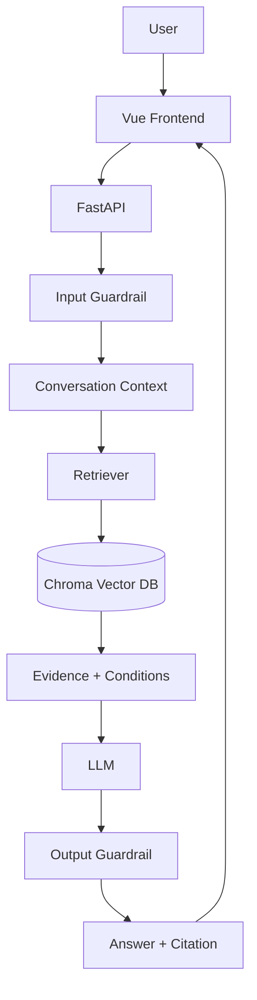

# InsureTutor：按顺序开发的执行清单

更新：2026-10-08。依据此前“NUS AIDF — InsureTutor 项目方案总结”、后续技术调整和用户的 12 个加分点。

按下列顺序开发。每步写清楚任务、候选方案、选择理由和验收；有实质取舍的模块才比较，简单功能直接做。完成后填实测结果，不为每个功能另建 Spec / Plan / Build 文档。

## 当前方向

- Vue 3 + Vite + TypeScript + 普通 CSS，一个聊天页面、少量组件。
- Python + FastAPI，原生 Python 组织 RAG；本地持久化 ChromaDB。
- PDF 解析比较现有 pypdf、PyMuPDF；MinerU 按实际解析问题引入。
- 必须交付聊天、RAG、Guardrails、中英文、Dockerfile、Compose、.env.example、README、真实增量 Git 提交。本项目还做简体/繁体/英文、可验证引用、领域案例、评测与耗时看板。
- 知识库只放保险材料，JD 和任务说明用于开发。截止时间以邀请邮件为准，任务本身只写收到后三天。

## 顺序总览

**第 0 步：先搭目录骨架（已完成）。** 建立前后端、数据、评测目录和职责说明。原始 PDF 保留 docs/，提取后的 raw 数据进 data/raw/，清洗/对齐/分块进 data/processed/，索引进 data/chroma/。尚未初始化应用依赖；完整 Vue + FastAPI + Docker 仍在第 3 步实现。

先把 PDF 提取、清洗并核对到足以建立参考答案，再设计问题。清洗不追求一次彻底结束：后续测试发现缺失或错序时继续修正；分块在此之后单独进行。

| 步骤 | 任务 | 做完得到什么 |
| --- | --- | --- |
| 1 | 解析比较、清洗、中英文对齐 | 带原始页码的可信条款数据 |
| 2 | 根据核对后的条款写首批测试题 | 10 个带参考证据的保险案例 |
| 3 | Vue + FastAPI + Docker 最小链路 | 页面可调用后端，容器可启动 |
| 4 | 条款分块、关联脚注 | 可追溯且条件完整的检索单元 |
| 5 | embedding + Chroma + 检索基线 | 真实证据命中结果 |
| 6 | 单轮生成、Citation、指标采集 | 一条完整可核验回答 |
| 7 | 输入/输出 Guardrails | 分类明确、行为可测的安全控制 |
| 8 | 独立会话记忆和追问 | 连贯且互不串话的对话 |
| 9 | 三语言完整页面 | 可演示的产品界面 |
| 10 | 完整测试、模型比较、看板 | 真实质量报告和性能数据 |
| 11 | 针对失败优化、讨论扩展 | 有实测支持的取舍结论 |
| 12 | 全新环境验收、README | 可复现、可解释的交付仓库 |

测试随模块加入，第 10 步做完整回归；Docker 第 3 步启动，第 12 步完整验收。各步按真实工作提交，不凑提交数量。

## 什么时候 commit

按下面这些点提交。每次留下一段能跑、能检查的进展，之后出了问题也方便回头找原因。节点不用卡得太死：两件事确实要一起做就一起提交，做到一半发现值得单独修的问题，也可以先提交修复。

代码和对应的测试放在同一次提交里。小的样式调整可以跟着页面功能一起交；单纯改文档就检查文档，不用再花钱跑模型。提交前看一遍 diff，只带上这次改动，别把 key、本地索引和运行日志放进去。

| 做到这里就提交 | 提交前检查什么 | commit 示例 |
| --- | --- | --- |
| 向量索引建好，能够保存和复用 | 用少量真实文本查一次；重启后能复用，数据或配置变了能识别；构建失败不损坏旧索引 | `feat: add persistent vector indexing` |
| 10 道题的检索结果跑出来 | 保存题集、模型和配置；分别看直接检索命中和补齐脚注后的覆盖情况，找出漏了什么 | `test: add the first retrieval baseline` |
| 第一条完整回答和引用跑通 | 结论能找到原文支持，引用能展开、点击跳到 PDF 对应页；没找到依据时能说明 | `feat: add answers with PDF citations` |
| 输入拦截做好 | 测无关问题、注入、个性化购买建议，也测正常保险问题，避免拦错 | `feat: add input guardrails` |
| 回答检查做好 | 重点测保证与非保证、缺失条件、错误引用、原文冲突；修正一次还不通过就明确返回失败 | `feat: check insurance answers before display` |
| 多轮对话做好 | 追问能接上，两个会话不串话；清空、过期和重启的行为说得清楚 | `feat: add isolated conversation history` |
| 三语言页面能完整使用 | 同一个事实用三种语言问，答案一致；引用保留原文；请求失败后能继续使用，前端构建通过 | `feat: complete multilingual chat` |
| 耗时和用量看板能用了 | 计时没有重复，token 用量来自实际返回；打开看板只读取结果，不重新调用模型 | `feat: add evaluation timings and usage dashboard` |
| 完整评测和模型比较做完 | 跑 20–30 题，人工核对关键答案；比较模型时固定其他条件，记录失败案例和最终选型理由 | `test: evaluate answer quality and model choices` |
| 评测暴露的问题修好了 | 用同一道失败题复测；如果是性能优化，留下前后耗时和质量对比 | 按实际问题写，例如 `fix: include withdrawal conditions in retrieved context` |
| Docker 在干净环境跑通 | 从没有索引开始启动，再测重启复用、错误配置和就绪状态；配置文件写好还不算完成 | `build: verify Docker startup from a clean state` |
| README 和交付说明写完 | 按说明重新走一遍；流程图与代码一致，写清测试结果、选型原因和还没解决的问题 | `docs: finish setup and project handover notes` |

这些提交要留下我们做选择的过程。比如检索漏掉提款限制，就记录漏在哪里、为什么补脚注、补完有没有改善；模型选型也写实际比较结果。理由写在这份文档或评测报告里，commit message 简短说明改了什么就够了。

每次完成后，在“当前进度”补上提交号和验证命令或报告位置。指标采集可以跟回答接口一起提交，看板页面后面再交，按实际开发顺序来。

### 目前的提交

- `4e1eb83`：项目初始化。
- `62cd277`：文档处理、首批参考题和可运行的前后端骨架。这次内容比较多，后面按上面的节点拆开提交。
- `0055f9f`：清理 macOS 元数据，补充验证记录。
- `e29490b`：在执行文档里补上提交安排。

接下来先做向量索引。前后端已经在本地跑通，Docker 还需要实际验证。已有提交保留，后面边做边提交。

## 1. 比较 PDF 工具，清洗并对齐中英文

- [ ] 先提取 docs/FLEXI-ULife Prime Saver.pdf，保留逐页原文，再做清洗；这是当前问答知识库。
- [ ] 在正文、多栏、表格、脚注、中英文页比较 pypdf 与 PyMuPDF；人工核对漏字、顺序、数字与页码。
- [ ] 优先评估 PyMuPDF 的文本块、坐标、页码与表格；pypdf 如果完整满足要求，也可保留更简单实现并记录理由。
- [ ] 复杂页面或扫描页试 MinerU；核对 OCR、结构和页码映射，确有改善才引入。
- [ ] 去重复页眉页脚、修断行，保存原始/清洗后文本；保留限制条件和免责声明。
- [ ] 同一条款建立 clause_group_id，关联英文/繁体版本，不把机器翻译写成 PDF 原文。
- [ ] 输出对齐表：双方证据、页码、数字核对、MATCHED / EN_ONLY / ZH_ONLY / CONFLICT。
- [ ] 解析漏项修工具；原文确实缺失就记录；原文冲突分别保留，回答提示，不能静默选边或为凑齐补造原文。

**取舍：** pypdf 依赖简单且已有文字输出；PyMuPDF 方便结合布局、页码校验；MinerU 有复杂结构处理能力，但增加模型与运行依赖。先轻量解析，再按失败页面补强，避免两个工具无条件全量运行。

**产物/验收：** data/processed/clauses.json、alignment.json，记录工具版本和文档哈希；关键数字脚注完整，中英文逐条对应，无法对应有记录。若用离线 MinerU 结果，版本化保存并写再生成说明，Docker 不依赖在线解析服务。

## 2. 根据清洗并核对后的条款，写 10 道代表性题目

- [ ] 基于第 1 步已清洗并核对的条款制定问题；参考事实仍回原 PDF 核验。
- [x] 建立 evaluation/questions.json，每题写预期事实、必要条件、参考证据、禁止的错误和预期安全行为（首批10题；真实模型验证待做）。
- [ ] 首批覆盖下面的专业案例，并保留部分题目用于最终验证。

| 案例 | 要验证什么 |
| --- | --- |
| 4% 是否保证？ | 假设/保证性质；材料历史日期不能说成当前报价 |
| 2.5% 是否是每年保费回报？ | 保证机制、计算基础、适用年限和条件 |
| 失业后能暂停缴费多久？ | 普通/特别宽限期、资格、保障范围 |
| 提款是否完全不影响保障？ | 提款条件、费用、保障调整及失效风险 |
| 周期提款何时申请？ | 年限、金额、持续时间一起解释 |
| 末期疾病是不是都赔？ | 定义、排除条件和材料未提供的内容 |
| “这个利率呢？它保证吗？” | 多轮指代和重新检索 |
| 同一事实三语言提问 | 跨语言事实与条件一致 |
| 注入指令、泄密、无关提问 | 安全分类与预期动作 |
| 推荐购买金额、询问未提供产品 | 个性化建议与证据范围 |

**取舍：** 开发后出题容易只测成功路径；先有可信文本再写题，随后用题目指导分块和检索，并发现清洗遗漏。参考事实由人工核对 PDF，不能只让模型出参考答案。

**验收：** 每个关键事实能回到原 PDF；此时只是建立验收依据，不代表系统已通过。

## 3. 搭最小前后端、Docker 和健康检查

- [ ] 建 frontend/、backend/、evaluation/、scripts/、data/；原始材料继续放 docs/。
- [x] Vue 放输入框与消息列表，调用 FastAPI 临时联通接口，明确标为联通测试。
- [x] 后端配置加载、错误响应、/health/live 和 /health/ready；RAG ready 当前明确返回503。
- [ ] Docker 多阶段构建：Node 编译前端，Python 运行 FastAPI，后端提供静态页面和 /api/ 接口。
- [ ] Compose + scripts/start.sh：检查 Docker、.env，启动并输出访问地址；README 先写最短启动说明。
- [ ] 模型与参数配置化，.env.example 用占位值，key 仅后端读取。

**取舍：** Streamlit UI 快；Vue 更符合用户偏好，也展示前后端交互。选 Vue 单页、普通 CSS、fetch 和局部状态，少量组件。交付一个运行容器便于启动；开发两端分开，Vite 代理 API。

**健康检查：** live 表示进程可响应；ready 表示配置、索引就绪。初始化中页面可打开，聊天明确返回未就绪。常规探针不反复付费调用模型，外部 API 连通性另做显式诊断。

**验收：** docker compose up --build 能访问页面与 API；使用者只需 Docker 和自己的 key，无需本地 Node/Python。首次构建下载依赖和首次索引仍需要网络。

## 4. 分块：小块检索，完整条款回答

### 为什么采用这个做法

- **是已有的 RAG 实践。** 按标题、段落和文档结构分块，以及用子块定位、关联父内容的做法有成熟应用；不是把原文凭理解改写成知识点。微软分块指南明确讨论结构化分块、自定义代码处理保险材料，以及块过小丢上下文、块过大增加噪声的取舍。
- **符合题目要求。** 任务要求基于保险文件检索并准确引用，没有指定拆分算法。保留原文、页码和证据关系，使此方案可以支撑 RAG、Citation 和准确性检查；最终还需验证整个问答链路。
- **不预先承诺最高召回率。** 分块质量与问题、embedding、Top-K 都有关。该方案对本材料的预期价值是保留条款完整性，尤其避免遗漏脚注条件。补齐上下文可以改善证据覆盖，但不能算作原始 Top-K 召回提升。
- **当前选择理由。** 固定长度方案作基线；条款分块 + 有界脚注补齐作候选主方案。用相同题集、embedding 和 Top-K 比较原始 Recall@5、补齐后条件覆盖、引用支持及上下文 tokens；以实测决定保留或调整。需要更多工程维护，原文金额冲突仍必须单独核对。

参考：[微软 RAG 分块指南](https://learn.microsoft.com/en-us/azure/architecture/ai-ml/guide/rag/rag-chunking-phase)、[父文档与子块关联](https://learn.microsoft.com/en-us/azure/search/search-how-to-define-index-projections)。这些参考支持方法存在与取舍，不代表本项目已经取得性能优势；本项目无需采用 Azure 服务或额外编排框架。

### 准备实施的最小步骤

1. 从已整理的 MinerU pages.json 读取正文、标题、表格、坐标和来源路径，不重新解析整份 PDF。
2. 先做利率、失业保障、定期提款三个样例；核对对应原文和已标记问题，保留修正前后内容及依据。
3. 用标题、段落、编号和位置归组；中英文对应人工核对。脚注按原文引用标记关联，不能只靠关键词猜关联。
4. 先输出 evidence.json：原始提取、排版清洗文本、页码、关联脚注、核对状态；有缺项或冲突就标记。无需人为改写成原子知识点。
5. 输出 chunks.json：同一标题下的短段落合并，长段落按句子边界拆分；保留 evidence_ids、parent_id 和关联脚注。表格按行保留表头及类别。
6. 用三个样例的题目检查正文和条件能否一起取到，再推广到全部材料；全量 embedding 和检索对比在第 5 步进行。

实现主要靠 Python 脚本，人工核对关键数字、脚注及语言对应；不逐段调用模型生成替代原文。规则处理第一版已实现，详见下方进度；全文双语语义核对和召回对比尚未完成。

- [ ] chunker.py 按条款/章节分块，过长条款再拆子块。
- [ ] 每块保存 evidence_id、parent_id、clause_group_id、文档、语言、章节、原文和实际页码范围。
- [ ] 小块命中后补齐父条款、相关脚注；跨页内容保留每片原文及其页码。
- [ ] 中英对应块关联同组，检索后按条款组去重，避免 Top-K 全是同一条款的语言副本。
- [ ] 限制补齐上下文预算，避免每次加入整个章节。
- [ ] 用首批题比较固定长度与条款方案：必要条件召回、上下文 tokens、失败案例。

**取舍：** 固定长度简单但易截断条件；整页保上下文但噪声多；条款分块加有界补齐多维护一些关联，却能兼顾检索精度与条件完整。因此选择第三种，长度/overlap 按数据调，不预称最佳。

**验收：** 利率证据能带出保证性质和适用条件；所有补齐内容都有证据 ID 和页码。

## 5. embedding、Chroma 与检索基线

- [ ] 显式生成文档/查询向量，避免意外使用 Chroma 默认 embedding 模型。
- [ ] 原方案 text-embedding-3-large 为起始候选，与 text-embedding-3-small 用首批跨语言题比较；分别建索引，不混向量空间。
- [ ] PersistentClient 保存向量、原文、元数据；复杂条款关系放 JSON，用标识连接。
- [ ] 索引版本包含 PDF 哈希、解析/分块版本、模型与维度；匹配复用，变更时新建成功后切换。
- [ ] Docker volume 保存索引，生成索引不提交 Git；首次构建显示状态，失败允许重试。
- [ ] Top-K 从 5 起步，保存原始命中与补齐结果，统计 Recall@5，分析漏检。

**取舍：** 全文输入难展示检索；FAISS 需额外管理原文/元数据；Chroma 集中检索与持久化；独立服务多部署环节。当前选本地 Chroma，后续按负载考虑服务化。

**embedding 决策：** 先看关键数字和跨语言召回，质量相近选成本较低方案；实测后填最终模型及理由，不默认 large 必胜。

**验收：** 能取必要证据、重启复用、模型/材料变化更新；记录真实 Recall@5（按必要证据组计，同义中英文可视为同一证据组），不把补齐结果冒充原始 Top-K 命中。

## 6. 单轮回答、可验证 Citation 和计时

- [ ] POST /api/chat 接问题和语言，接通证据限定问答，基础范围/安全规则同时接入。
- [ ] 模型结构化输出回答和证据 ID，禁止补造事实、来源和当前利率。
- [ ] 后端验证 ID 来自本次证据；检查结论的支持关系，尤其数字、保证性质、条件。
- [ ] 引用展示 PDF 完整名称、实际页码、原文，关联具体结论；原文直接取自证据。
- [ ] 文档白名单接口 /api/documents/{document_id} 提供 PDF，引用链接加 #page=N；不开放任意文件路径。
- [ ] 原文展开作为独立核验方式，浏览器不支持页码跳转时仍明确显示页码。
- [ ] 采集 request_id、阶段耗时、命中数和真实 usage，为看板准备数据。

**取舍：** 模型自由写页码易虚构，选后端按真实 ID 组装。ID 合法只是必要条件，语义支持还需核查与黄金题校准。完整生成检查后再展示，等待时显示状态，流式输出后置。

**验收：** 中英文各一条完整回答，关键结论来源可点可核验；虚假引用不能成功返回；超时/限流给明确错误。

## 7. 完善 Guardrails，原因和动作分开

- [ ] enum 结果记录 reason、action、简短理由，支持多个原因。
- [ ] 输入判范围、注入、建议边界；证据不足在检索后判断。
- [ ] 输出查无据结论、引用、保证性质和缺失条件；失败最多修正一次，再失败说明不足。
- [ ] 用户和 PDF 中的指令不能覆盖系统规则；key 不发给模型；加入正常保险问题误拒测试。

| 原因 enum | 处理 |
| --- | --- |
| OUT_OF_SCOPE_GENERAL | 编程/无关问题：引导回保险 |
| UNSUPPORTED_PRODUCT | 未提供产品：说明无该资料 |
| PERSONAL_FINANCIAL_ADVICE | 个性化购买金额/收益决策：说明边界，可解释条款 |
| MEDICAL_OR_LEGAL_ADVICE | 诊断/个案法律判断：说明边界；疾病保障条款正常解释 |
| PROMPT_INJECTION | 忽略恶意指令；安全部分可继续回答 |
| SECRET_OR_PRIVATE_DATA_REQUEST | 索要 key、系统秘密、他人会话：拒绝 |
| INSUFFICIENT_EVIDENCE | 说明材料不足，不编造 |
| SOURCE_CONFLICT | 说明原始材料冲突，分别引用 |
| FALSE_PREMISE | 用证据纠正前提并解释 |
| UNSUPPORTED_OUTPUT | 修正无据结论，失败不展示 |
| INVALID_CITATION | 修正引用，失败不展示 |
| INSURANCE_CONDITION_MISMATCH | 修正保证性质/年限/计算基础错误 |

动作：ANSWER、CLARIFY、CORRECT、REFUSE、REVISE。超时、索引未就绪另用系统错误码，不能混成用户违规。

**取舍：** 关键词规则快但易误拒，纯模型判断灵活但有延时与不确定性；选明确规则+语义判断+证据核查，能合并的检查合并，并记录耗时。enum 覆盖已定义案例，不能声称穷尽所有攻击。

**验收：** 各类有正反例，guaranteed 专业案例通过；错误前提、正常疾病保障问答不会被一刀切拒绝。

## 8. 单个 conversation 的短期记忆

- [ ] 后端生成不可预测的会话凭证，历史按会话隔离，前端持有自己的凭证。
- [ ] 单进程内存保存，限制轮数、长度与 TTL；清空同时删除后端历史。
- [ ] 历史明确指代后再检索；不明确则澄清，历史不能作为保险事实证据。
- [ ] 测两个会话并行、清空、过期、重启；前文回答错了也按原文纠正。

**取舍：** 前端带全历史简单但请求大、历史不可信；Redis/数据库支持多实例和长期保存但增加依赖。选受限后端内存、单 worker，长期记忆作为未来扩展，届时需要共享存储和身份访问控制。

**验收：** 追问跟随本会话，A/B 不串话；明确说明重启后历史丢失。

## 9. 完成三语言页面

- [ ] 消息、发送、等待、重试、清空、示例问题，少量组件即可。
- [ ] English / 简体 / 繁體：界面简单字典，回答按所选语言生成。
- [ ] Citation 原文展开、PDF 链接；改变回答语言不改原始证据。
- [ ] 显示初始化、模型不可用等真实状态。
- [ ] 相同事实三语言提问，检查条件一致；简体问题可引用繁体或英文原文。

**验收：** 三语言+多轮+引用可完整演示，错误后仍可继续操作。简单按钮和选择框直接实现，不单独写方案。

## 10. 扩充评测、模型对比、做看板

- [ ] 扩至 20–30 题，覆盖条款、数字、多轮、跨语言、安全、误拒、无据和冲突。
- [ ] pytest 测关键易错逻辑：页码、脚注、对齐、索引版本、引用、会话隔离、安全动作；模拟模型确保无需付费复跑。
- [ ] 独立真实评测脚本记录问题、证据、答案、分类、阶段耗时、usage 与人工核对结果；保存评测题，普通用户会话默认不落盘。
- [ ] 原方案 GPT-5.4 与已成功调用模型作为候选，先确认可用；保持题集、检索、提示词一致，比较事实/条件/引用/安全/耗时/usage，填写最终选择与理由。
- [ ] Vue 增一个简单评测视图，读取保存报告，按语言、类别、成败筛选；打开看板不自动重新付费评测。

**看板每案例：** Retrieval、LLM、Total、Retrieved chunks、Expanded chunks、Input tokens、Output tokens、Guardrail 分类、通过情况、引用链接。用户示例的 82 ms/1.4 s 只是格式，不写成实测。

**口径：** 分别计查询 embedding、数据库查询、补齐、上下文处理、生成、检查、修正。Retrieval 汇总前三项；LLM 为回答生成；模型核查另显示；Total 为请求起止墙钟时间，不重叠重复相加。短路未执行显示未执行；tokens 取真实接口 usage，缺失为未知，重试用量累计并记录次数。

**汇总：** Recall@5、引用支持准确率、关键结论引用覆盖、答案正确、安全通过/误拒、耗时 p50/p95；显示样本数，小题集分位数不代表生产负载。

**取舍：** pytest 稳定验证代码，不能证明模型质量；真实评测有成本和波动，却能发现实际错误。两类都做，关键金融事实人工校准；模型更大不等于实测更适合。

**验收：** 真实报告能逐题定位失败与耗时；生成/embedding 选型有证据或明确局限，不编造分数。

## 11. 针对失败优化，讨论扩展

- [ ] 数字/术语漏检试 Vector + BM25，同题比较召回、答案、延时后决定。
- [ ] 条件漏掉先修清洗/分块/补齐，不盲目换模型。
- [ ] 生成慢比较模型、证据预算、合并检查；不为提速删除必要条件。
- [ ] embedding 慢评估有版本/容量限制的查询缓存，验证失效与收益。
- [ ] 文档增加关注增量索引、筛选、检索负载；并发增加关注独立向量服务、共享会话存储、多应用实例。
- [ ] 扩展候选包括服务端 Chroma、Qdrant、已有 PostgreSQL 时的 pgvector；到目标负载再比较部署、运维、吞吐和 p95。

**取舍/验收：** 混合检索增加调参，缓存增加失效管理，独立服务增加运维。只保留解决实测瓶颈的改动，写基线→变更→复测→收益/代价。未压测的扩展方案标待验证，不能承诺未来降低多少延时。

## 12. 全新环境验收、README 和交付

- [ ] 无旧索引启动 Docker，完成初始化问答；重启复用索引。
- [ ] 检查 live/ready、失败重试、缺 key、超时、版本变化；启动脚本等就绪有超时和诊断。
- [ ] 回归专业题、多轮、三语言，修事实/引用严重错误，剩余局限如实记录。
- [ ] .env/key 不在 Git；索引、日志、本地环境不提交。
- [ ] README 写运行、首次启动、流程图、真实评测、取舍、局限与扩展。
- [ ] 每项重要决策四行：问题→候选→选择及理由→实测证据/局限，不另做庞大文档。
- [ ] 可选短视频演示语言、追问、引用跳页、guaranteed、安全、看板；按邮件提交仓库和权限。

README 主图：

主图展示正常路径，澄清/拒绝/初始化失败在正文说明；向量库返回证据，模型接收的是证据。

## 12 个加分点的对应位置

| 加分点 | 步骤 |
| --- | --- |
| 1. 可核验、可点击 Citation | 1、4、6、9 |
| 2. 安全 enum | 7 |
| 3. 专业 insurance / guaranteed | 2、6、7、10 |
| 4. chunk 取舍 | 4、5、11 |
| 5. 中英文清洗对齐 | 1、4、9 |
| 6. 会话隔离，长期记忆后置 | 8 |
| 7. 耗时看板与未来优化 | 6、10、11 |
| 8. 自动化测试 | 随模块加入、10、12 |
| 9. Health check / 一键启动 | 3、12 |
| 10. README 流程图 | 12 |
| 11. 模型选择取舍 | 5、10 |
| 12. MinerU / PyMuPDF 取舍 | 1 |

## 当前进度与记录方式

### MinerU 数据接入

- 用户已提供 Markdown 与含 20 页的 MinerU JSON；元数据版本 3.4.4，后端 hybrid，OCR 标记为关闭。
- scripts/normalize_mineru.py 已运行：正文 226 块、标题 72 块、表格 9 块，另保留图片/图表引用和解析器丢弃块。
- data/processed/mineru/ 保存逐页结构、来源哈希和初步检查报告；页码转换、块数量和 ID 唯一性已检查。
- 标记 6 个块待核对，其中包含控制字符、可能的金额缺失和粘连百分比；这不是完整准确率评估。
- 之后已完成规则清洗/分块第一版，见下一节；不需重新全量运行 MinerU。

### 规则清洗与分块第一版

- 实现：backend/app/rag/preprocess.py、scripts/prepare_knowledge.py；仅 Python 标准库，无模型/embedding 调用。
- 结果：288 条来源证据、136 个父段落/行组、138 个检索块、10 组按编号关联的双语脚注。每条有原始提取、清洗文本、页码、坐标、源 JSON 指针；每块记录实际包含的证据 ID。
- 参数：上限 1200 字符，超长段落 overlap 120 字符；不是 token 数，不声称最优。标题下短段落合并，表格按行处理，合并单元格的类别保留。
- 修复：目视核对 PDF 第8、12、16页后记录 7 项处理：恢复控制字符“總”、提款脚注6编号、英文 HK$4,000、额外回报率/年份关系。原始提取与 HTML 未覆盖，配置绑定输入哈希。
- 原文冲突：PDF 第17页增加/减少保障额中英文的港币/澳门币金额确实不同，保留 SOURCE_CONFLICT，后续回答必须提示，不能自行改成一致。
- 验证：`.venv/bin/python -m unittest discover -s backend/tests -v`，8 项通过，覆盖金额断行、跨页条件、非保证脚注、修复原文保留、表格跨行、证据覆盖、长度与修复输入版本检查。
- 产物：data/processed/knowledge/，包含 evidence、parents、chunks、alignment、changes、omitted_blocks、manifest、review；samples.md 展示利率、失业、提款实际关联。
- 局限：全文中英文语义对应未核对完成；32 个未提取出文字的图片块不进入索引，不能宣称图示全部覆盖；阅读关系继承 MinerU，需要后续案例验证；尚未生成向量或测试召回。
- 下一步：以清洗证据建立首批黄金题，核对取回条件，再接 embedding 和检索基线。

已完成目录骨架、材料与环境配置、API 连通性、MinerU 结构整理和规则清洗分块第一版。完整应用、题集、真实评测与 Docker 尚未完成；未实现的路径/命令仍为计划。

### 首批黄金题与检索计分准备

- evaluation/questions.json 已写10题，覆盖利率保证、失业、提款、失效风险、三语言、多轮、原文冲突、指令注入/泄密和个性化建议；记录预期事实、禁止结论、正确证据组和页码，保留 validation 案例。
- evaluation/scoring.py 与 scripts/evaluate_retrieval.py 可验证题集，或接收实际排名计算 Recall@5；脚注补齐覆盖率单独报告，安全短路题没有检索分母，答案/引用质量不从召回推断。
- 局部利率脚注也纳入可检索分块，仍保留显式关联；检索块由138调整为139，证据仍为288条。
- 运行题集检查：10题证据及页码有效。自动逻辑检查共12项通过；尚未运行真实检索或模型，不填虚构召回/质量分数。
- 题集只是参考验收依据，全文语义核对未全部完成；后续扩充无依据、越界和误拒等案例到20–30题。

### 可运行应用骨架

- Vue 单页、FastAPI 接口与依赖已初始化。前端 npm 锁文件与后端精确版本锁文件已生成，页面清楚标记连接测试。
- 已接入 live、ready、status、demo、PDF 白名单接口。支持 PDF inline 和 Range 响应；链接可加实际页码，但浏览器跳页行为尚未做人工验证。回答 Citation/原文展开仍未接入。
- scripts/dev.sh 已实机启动两端；npm run build 类型检查和构建成功；check_local.py 验证主页、静态资源、连接测试、健康、PDF 范围请求及私有路径404通过。自动检查共16项通过，不调用模型。
- Dockerfile、Compose、.dockerignore 与 start.sh 已写好，采用多阶段构建、非root运行、单服务和索引volume。当前机器未检测到 Docker，尚未验证容器构建和启动，不能标记 Docker 验收通过。
- 当前 live=200，ready=503；Docker health 使用 live，只表示网页可用，不能冒充 RAG 已就绪。
- 取舍：先完成真实前后端链路与资料访问，连接测试单独接口，保险 chat 暂返回503，避免假回答掩盖未实现功能。
- 本地增量提交：62cd277（文档处理与可运行应用骨架）；未推送远程。

下一步接 embedding、Chroma 和首批实际检索评测；Docker 实机验收待本机 Docker 可用后补做。每步完成时记录实际文件、运行证据、调整理由、局限与真实提交标识；简单功能不另建文档。

## 工具依据

- [PyMuPDF 文本、布局与表格](https://pymupdf.readthedocs.io/en/latest/recipes-text.html)
- [MinerU 官方项目](https://github.com/opendatalab/MinerU)
- [OpenAI embedding 文档](https://developers.openai.com/api/docs/guides/embeddings)
- [Chroma Python 客户端](https://docs.trychroma.com/reference/python/client)

工具能力以官方文档为依据，项目实际效果以本材料评测为准。
